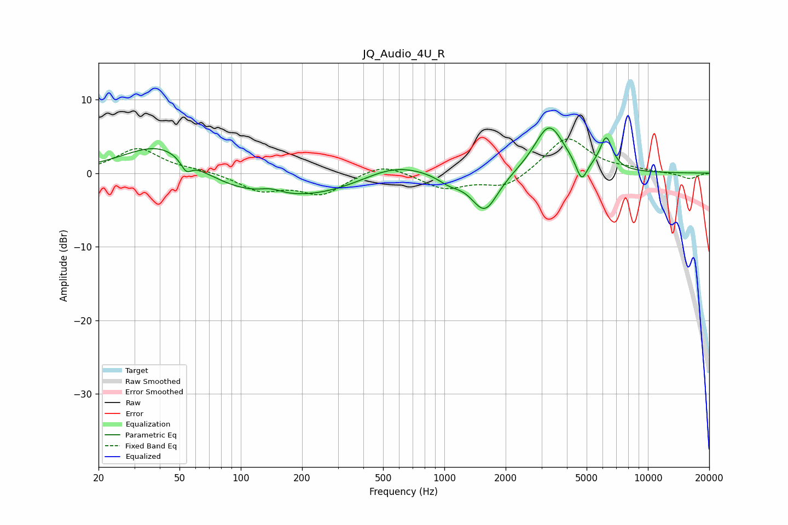

# JQ_Audio_4U_R
See [usage instructions](https://github.com/jaakkopasanen/AutoEq#usage) for more options and info.

### Parametric EQs
Apply preamp of -6.2 dB when using parametric equalizer.

|   # | Type    |   Fc (Hz) |    Q |   Gain (dB) |
|-----|---------|-----------|------|-------------|
|   1 | Peaking |        41 | 0.74 |         5.8 |
|   2 | Peaking |        54 | 5.53 |        -1.6 |
|   3 | Peaking |       137 | 0.27 |        -4.1 |
|   4 | Peaking |       140 | 2.44 |         0.8 |
|   5 | Peaking |       560 | 0.83 |         2.6 |
|   6 | Peaking |      1059 | 2.42 |        -1   |
|   7 | Peaking |      1580 | 2.13 |        -5.3 |
|   8 | Peaking |      3272 | 1.92 |         6.6 |
|   9 | Peaking |      4724 | 5.27 |        -2.9 |
|  10 | Peaking |      6240 | 4.42 |         4.4 |

### Fixed Band EQs
When using fixed band (also called graphic) equalizer, apply preamp of **-4.7 dB** (if available) and set gains manually with these parameters.

|   # | Type    |   Fc (Hz) |    Q |   Gain (dB) |
|-----|---------|-----------|------|-------------|
|   1 | Peaking |        31 | 1.41 |         3.4 |
|   2 | Peaking |        62 | 1.41 |         0.4 |
|   3 | Peaking |       125 | 1.41 |        -2.2 |
|   4 | Peaking |       250 | 1.41 |        -2.8 |
|   5 | Peaking |       500 | 1.41 |         1.5 |
|   6 | Peaking |      1000 | 1.41 |        -2.1 |
|   7 | Peaking |      2000 | 1.41 |        -2   |
|   8 | Peaking |      4000 | 1.41 |         5   |
|   9 | Peaking |      8000 | 1.41 |         0.4 |
|  10 | Peaking |     16000 | 1.41 |        -0.8 |

### Graphs

