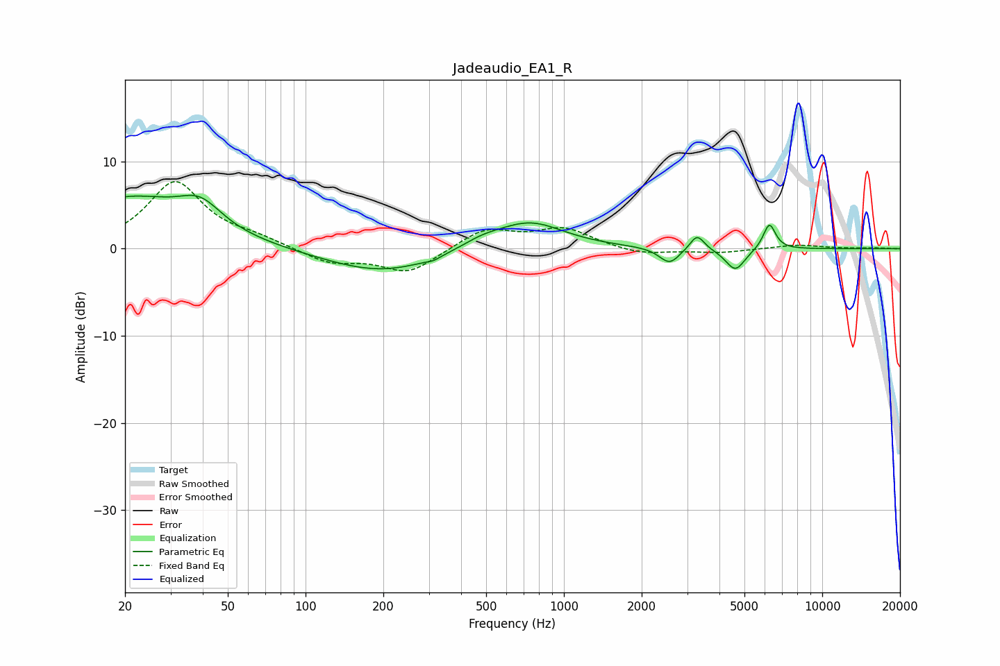

# Jadeaudio_EA1_R
See [usage instructions](https://github.com/jaakkopasanen/AutoEq#usage) for more options and info.

### Parametric EQs
Apply preamp of -6.2 dB when using parametric equalizer.

|   # | Type    |   Fc (Hz) |    Q |   Gain (dB) |
|-----|---------|-----------|------|-------------|
|   1 | Peaking |        20 | 0.59 |         5.6 |
|   2 | Peaking |        39 | 1.73 |         2.8 |
|   3 | Peaking |       198 | 0.63 |        -2.8 |
|   4 | Peaking |       313 | 5.98 |        -0.3 |
|   5 | Peaking |       478 | 1.76 |         0.9 |
|   6 | Peaking |       734 | 1.05 |         3.2 |
|   7 | Peaking |      2564 | 3.62 |        -1.8 |
|   8 | Peaking |      3279 | 5.12 |         1.8 |
|   9 | Peaking |      4610 | 3.74 |        -2.5 |
|  10 | Peaking |      6242 | 5.78 |         3   |

### Fixed Band EQs
When using fixed band (also called graphic) equalizer, apply preamp of **-7.8 dB** (if available) and set gains manually with these parameters.

|   # | Type    |   Fc (Hz) |    Q |   Gain (dB) |
|-----|---------|-----------|------|-------------|
|   1 | Peaking |        31 | 1.41 |         7.6 |
|   2 | Peaking |        62 | 1.41 |         0.9 |
|   3 | Peaking |       125 | 1.41 |        -1.6 |
|   4 | Peaking |       250 | 1.41 |        -2.8 |
|   5 | Peaking |       500 | 1.41 |         2.3 |
|   6 | Peaking |      1000 | 1.41 |         2.2 |
|   7 | Peaking |      2000 | 1.41 |        -0.7 |
|   8 | Peaking |      4000 | 1.41 |        -0.4 |
|   9 | Peaking |      8000 | 1.41 |         0.5 |
|  10 | Peaking |     16000 | 1.41 |         0.1 |

### Graphs

