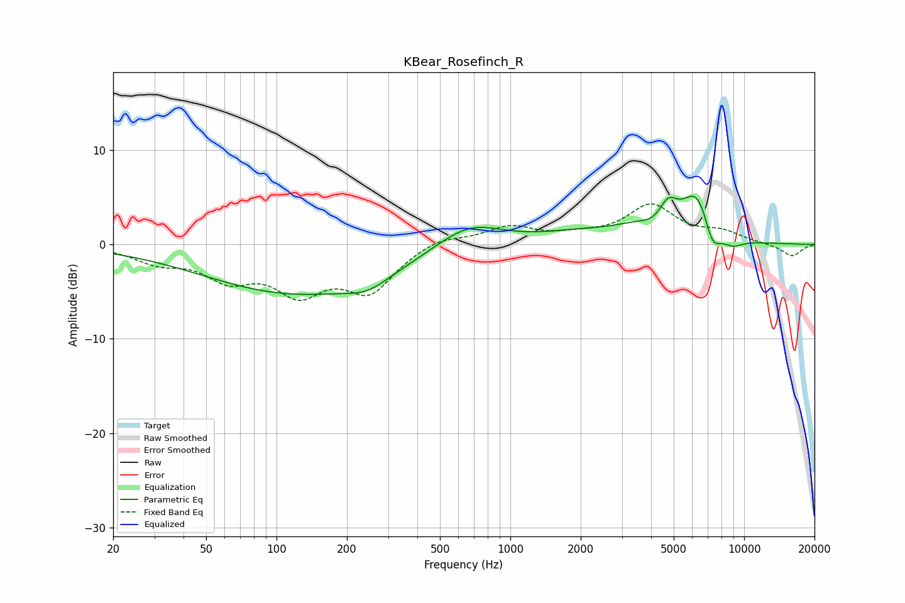

# KBear_Rosefinch_R
See [usage instructions](https://github.com/jaakkopasanen/AutoEq#usage) for more options and info.

### Parametric EQs
Apply preamp of -5.2 dB when using parametric equalizer.

|   # | Type    |   Fc (Hz) |    Q |   Gain (dB) |
|-----|---------|-----------|------|-------------|
|   1 | Peaking |       122 | 0.35 |        -5.1 |
|   2 | Peaking |       245 | 1.49 |        -1.3 |
|   3 | Peaking |       665 | 0.99 |         2.7 |
|   4 | Peaking |      1921 | 0.84 |         0.9 |
|   5 | Peaking |      3800 | 1.11 |         1.9 |
|   6 | Peaking |      4270 | 1.94 |        -1.4 |
|   7 | Peaking |      4721 | 3.42 |         2.8 |
|   8 | Peaking |      6301 | 2.07 |         5.1 |
|   9 | Peaking |      7310 | 3.81 |        -2.9 |
|  10 | Peaking |      8848 | 2.57 |        -1.1 |

### Fixed Band EQs
When using fixed band (also called graphic) equalizer, apply preamp of **-4.4 dB** (if available) and set gains manually with these parameters.

|   # | Type    |   Fc (Hz) |    Q |   Gain (dB) |
|-----|---------|-----------|------|-------------|
|   1 | Peaking |        31 | 1.41 |        -1.6 |
|   2 | Peaking |        62 | 1.41 |        -3.1 |
|   3 | Peaking |       125 | 1.41 |        -4.5 |
|   4 | Peaking |       250 | 1.41 |        -4.6 |
|   5 | Peaking |       500 | 1.41 |         0.9 |
|   6 | Peaking |      1000 | 1.41 |         1.8 |
|   7 | Peaking |      2000 | 1.41 |         0.7 |
|   8 | Peaking |      4000 | 1.41 |         4   |
|   9 | Peaking |      8000 | 1.41 |         1.1 |
|  10 | Peaking |     16000 | 1.41 |        -1.3 |

### Graphs

