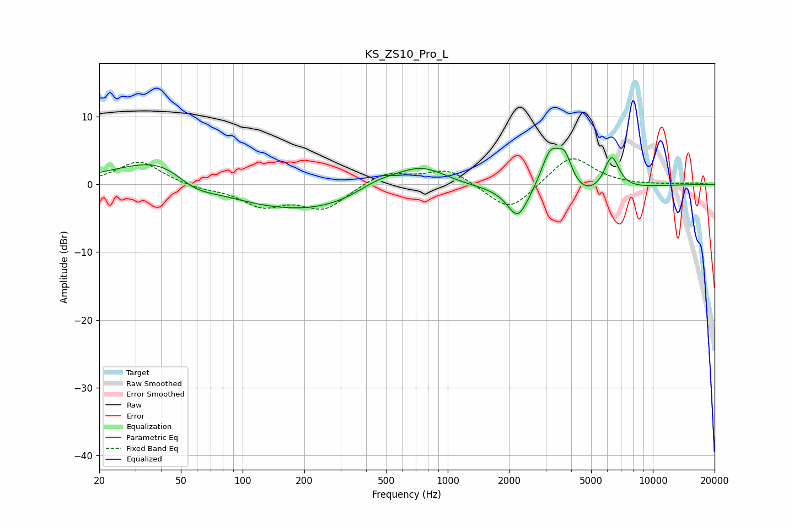

# KS_ZS10_Pro_L
See [usage instructions](https://github.com/jaakkopasanen/AutoEq#usage) for more options and info.

### Parametric EQs
Apply preamp of -5.4 dB when using parametric equalizer.

|   # | Type    |   Fc (Hz) |    Q |   Gain (dB) |
|-----|---------|-----------|------|-------------|
|   1 | Peaking |        44 | 0.64 |         7.1 |
|   2 | Peaking |        57 | 1.22 |        -3.2 |
|   3 | Peaking |       174 | 0.22 |        -4.9 |
|   4 | Peaking |       454 | 1.12 |         2.5 |
|   5 | Peaking |       744 | 1.04 |         4   |
|   6 | Peaking |      2194 | 2.85 |        -4.4 |
|   7 | Peaking |      3161 | 2.92 |         6.2 |
|   8 | Peaking |      3724 | 3.6  |         4.9 |
|   9 | Peaking |      4038 | 0.85 |        -3   |
|  10 | Peaking |      6296 | 3.71 |         5.2 |

### Fixed Band EQs
When using fixed band (also called graphic) equalizer, apply preamp of **-3.9 dB** (if available) and set gains manually with these parameters.

|   # | Type    |   Fc (Hz) |    Q |   Gain (dB) |
|-----|---------|-----------|------|-------------|
|   1 | Peaking |        31 | 1.41 |         3.5 |
|   2 | Peaking |        62 | 1.41 |        -0.6 |
|   3 | Peaking |       125 | 1.41 |        -3   |
|   4 | Peaking |       250 | 1.41 |        -3.5 |
|   5 | Peaking |       500 | 1.41 |         1.9 |
|   6 | Peaking |      1000 | 1.41 |         2.3 |
|   7 | Peaking |      2000 | 1.41 |        -4.2 |
|   8 | Peaking |      4000 | 1.41 |         4.4 |
|   9 | Peaking |      8000 | 1.41 |        -0.1 |
|  10 | Peaking |     16000 | 1.41 |         0.2 |

### Graphs

