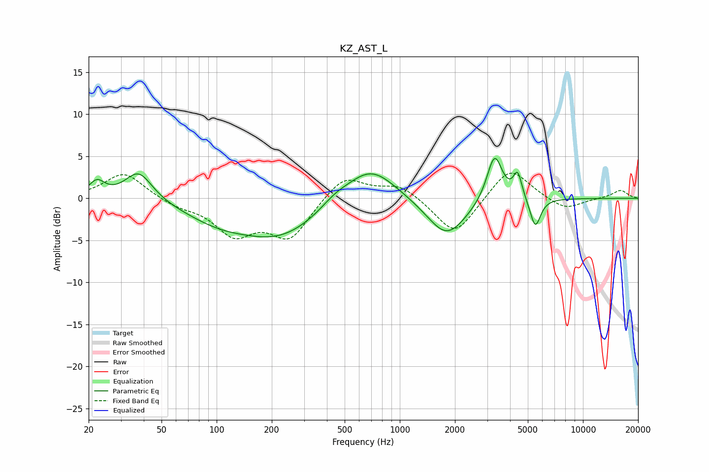

# KZ_AST_L
See [usage instructions](https://github.com/jaakkopasanen/AutoEq#usage) for more options and info.

### Parametric EQs
Apply preamp of -4.8 dB when using parametric equalizer.

|   # | Type    |   Fc (Hz) |    Q |   Gain (dB) |
|-----|---------|-----------|------|-------------|
|   1 | Peaking |        22 | 3.29 |         1.8 |
|   2 | Peaking |        38 | 1.89 |         3.5 |
|   3 | Peaking |       101 | 0.76 |        -2   |
|   4 | Peaking |       225 | 0.63 |        -4.2 |
|   5 | Peaking |       442 | 1.8  |         0.9 |
|   6 | Peaking |       690 | 1.03 |         4.3 |
|   7 | Peaking |      1802 | 1.3  |        -4.7 |
|   8 | Peaking |      3291 | 3.32 |         5.7 |
|   9 | Peaking |      4400 | 6    |         3   |
|  10 | Peaking |      5491 | 4.85 |        -3.5 |

### Fixed Band EQs
When using fixed band (also called graphic) equalizer, apply preamp of **-3.1 dB** (if available) and set gains manually with these parameters.

|   # | Type    |   Fc (Hz) |    Q |   Gain (dB) |
|-----|---------|-----------|------|-------------|
|   1 | Peaking |        31 | 1.41 |         3.1 |
|   2 | Peaking |        62 | 1.41 |        -0.8 |
|   3 | Peaking |       125 | 1.41 |        -4   |
|   4 | Peaking |       250 | 1.41 |        -4.6 |
|   5 | Peaking |       500 | 1.41 |         2.9 |
|   6 | Peaking |      1000 | 1.41 |         1.7 |
|   7 | Peaking |      2000 | 1.41 |        -4.6 |
|   8 | Peaking |      4000 | 1.41 |         3.9 |
|   9 | Peaking |      8000 | 1.41 |        -1.4 |
|  10 | Peaking |     16000 | 1.41 |         1   |

### Graphs

