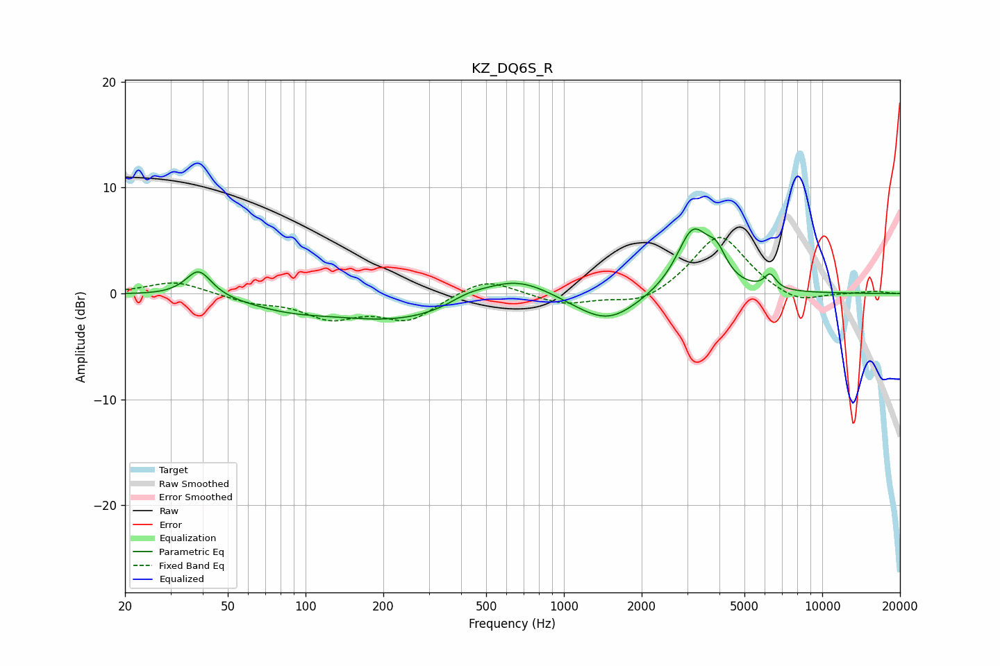

# KZ_DQ6S_R
See [usage instructions](https://github.com/jaakkopasanen/AutoEq#usage) for more options and info.

### Parametric EQs
Apply preamp of -6.2 dB when using parametric equalizer.

|   # | Type    |   Fc (Hz) |    Q |   Gain (dB) |
|-----|---------|-----------|------|-------------|
|   1 | Peaking |        39 | 2.88 |         2.6 |
|   2 | Peaking |        86 | 0.85 |        -1   |
|   3 | Peaking |       237 | 0.53 |        -2.5 |
|   4 | Peaking |       423 | 2.04 |         0.6 |
|   5 | Peaking |       643 | 0.99 |         2.3 |
|   6 | Peaking |      1196 | 1.18 |        -0.5 |
|   7 | Peaking |      1504 | 1.24 |        -2.4 |
|   8 | Peaking |      3156 | 2.23 |         5.9 |
|   9 | Peaking |      3904 | 3.72 |         2.2 |
|  10 | Peaking |      6288 | 6    |         1.4 |

### Fixed Band EQs
When using fixed band (also called graphic) equalizer, apply preamp of **-5.4 dB** (if available) and set gains manually with these parameters.

|   # | Type    |   Fc (Hz) |    Q |   Gain (dB) |
|-----|---------|-----------|------|-------------|
|   1 | Peaking |        31 | 1.41 |         1.2 |
|   2 | Peaking |        62 | 1.41 |        -0.7 |
|   3 | Peaking |       125 | 1.41 |        -2.1 |
|   4 | Peaking |       250 | 1.41 |        -2.4 |
|   5 | Peaking |       500 | 1.41 |         1.6 |
|   6 | Peaking |      1000 | 1.41 |        -1.1 |
|   7 | Peaking |      2000 | 1.41 |        -1.2 |
|   8 | Peaking |      4000 | 1.41 |         5.7 |
|   9 | Peaking |      8000 | 1.41 |        -1.1 |
|  10 | Peaking |     16000 | 1.41 |         0.2 |

### Graphs

