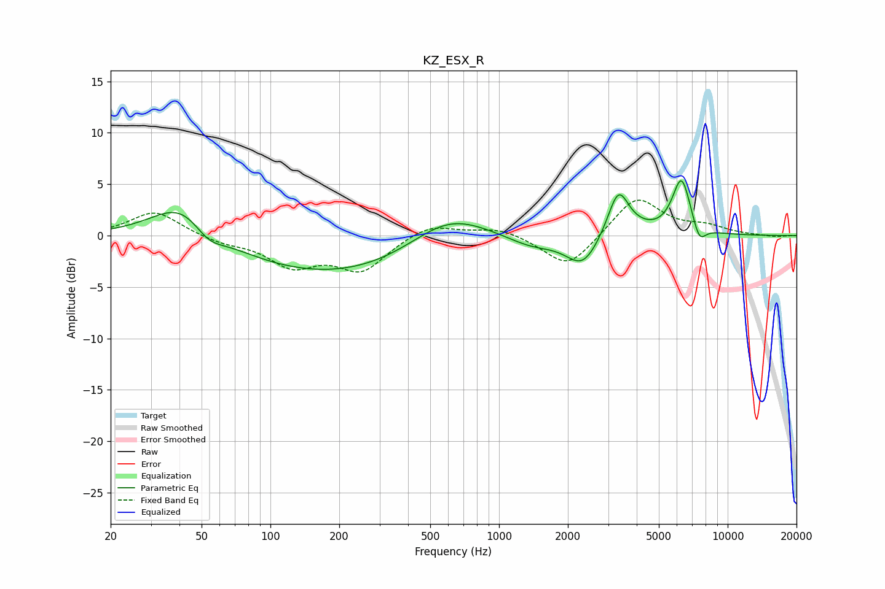

# KZ_ESX_R
See [usage instructions](https://github.com/jaakkopasanen/AutoEq#usage) for more options and info.

### Parametric EQs
Apply preamp of -5.4 dB when using parametric equalizer.

|   # | Type    |   Fc (Hz) |    Q |   Gain (dB) |
|-----|---------|-----------|------|-------------|
|   1 | Peaking |        42 | 1.03 |         4.1 |
|   2 | Peaking |        53 | 2.03 |        -1.8 |
|   3 | Peaking |       213 | 0.3  |        -4.1 |
|   4 | Peaking |       600 | 0.77 |         3.9 |
|   5 | Peaking |      1390 | 1.29 |        -1   |
|   6 | Peaking |      2322 | 1.96 |        -3   |
|   7 | Peaking |      3327 | 3    |         4.6 |
|   8 | Peaking |      4172 | 2.1  |         0.2 |
|   9 | Peaking |      6283 | 3.36 |         5.6 |
|  10 | Peaking |      7510 | 4.7  |        -1.8 |

### Fixed Band EQs
When using fixed band (also called graphic) equalizer, apply preamp of **-3.5 dB** (if available) and set gains manually with these parameters.

|   # | Type    |   Fc (Hz) |    Q |   Gain (dB) |
|-----|---------|-----------|------|-------------|
|   1 | Peaking |        31 | 1.41 |         2.4 |
|   2 | Peaking |        62 | 1.41 |        -0.6 |
|   3 | Peaking |       125 | 1.41 |        -2.7 |
|   4 | Peaking |       250 | 1.41 |        -3.2 |
|   5 | Peaking |       500 | 1.41 |         1.3 |
|   6 | Peaking |      1000 | 1.41 |         0.8 |
|   7 | Peaking |      2000 | 1.41 |        -3.3 |
|   8 | Peaking |      4000 | 1.41 |         3.9 |
|   9 | Peaking |      8000 | 1.41 |         0.8 |
|  10 | Peaking |     16000 | 1.41 |        -0.1 |

### Graphs

