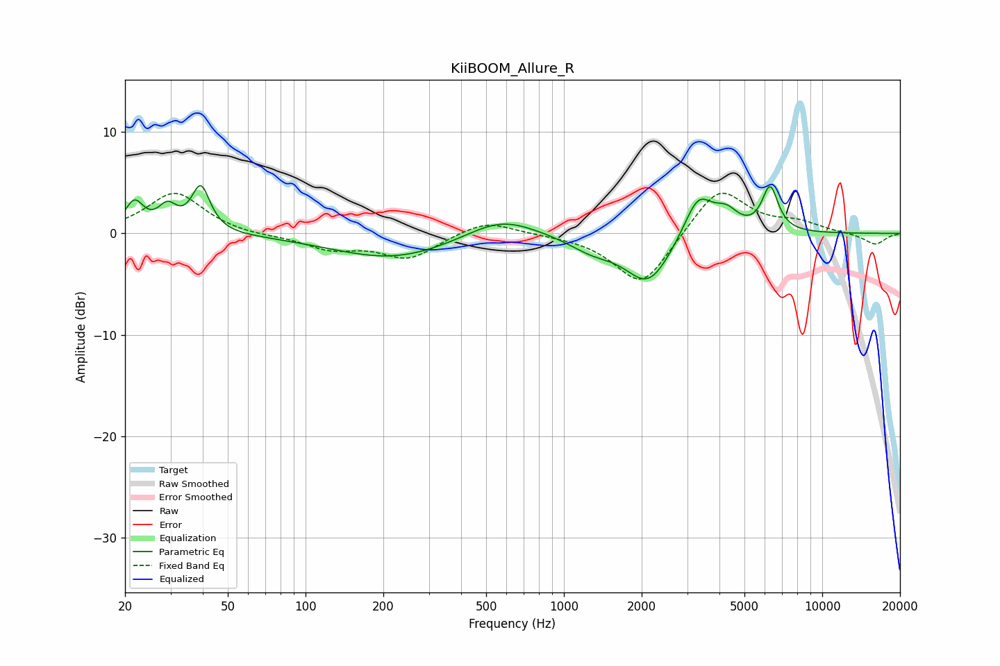

# KiiBOOM_Allure_R
See [usage instructions](https://github.com/jaakkopasanen/AutoEq#usage) for more options and info.

### Parametric EQs
Apply preamp of -4.8 dB when using parametric equalizer.

|   # | Type    |   Fc (Hz) |    Q |   Gain (dB) |
|-----|---------|-----------|------|-------------|
|   1 | Peaking |        22 | 3.96 |         2.8 |
|   2 | Peaking |        29 | 3.91 |         2.2 |
|   3 | Peaking |        39 | 4.02 |         4.5 |
|   4 | Peaking |       218 | 0.6  |        -2.5 |
|   5 | Peaking |       570 | 1.04 |         2.1 |
|   6 | Peaking |      1284 | 1.52 |        -1.3 |
|   7 | Peaking |      2124 | 1.58 |        -4.9 |
|   8 | Peaking |      3313 | 2.49 |         4.2 |
|   9 | Peaking |      4256 | 3.02 |         1.8 |
|  10 | Peaking |      6283 | 4.4  |         4.4 |

### Fixed Band EQs
When using fixed band (also called graphic) equalizer, apply preamp of **-4.1 dB** (if available) and set gains manually with these parameters.

|   # | Type    |   Fc (Hz) |    Q |   Gain (dB) |
|-----|---------|-----------|------|-------------|
|   1 | Peaking |        31 | 1.41 |         4.1 |
|   2 | Peaking |        62 | 1.41 |        -0.3 |
|   3 | Peaking |       125 | 1.41 |        -1.4 |
|   4 | Peaking |       250 | 1.41 |        -2.4 |
|   5 | Peaking |       500 | 1.41 |         1.4 |
|   6 | Peaking |      1000 | 1.41 |        -0.1 |
|   7 | Peaking |      2000 | 1.41 |        -5.3 |
|   8 | Peaking |      4000 | 1.41 |         4.7 |
|   9 | Peaking |      8000 | 1.41 |         0.9 |
|  10 | Peaking |     16000 | 1.41 |        -1.1 |

### Graphs

