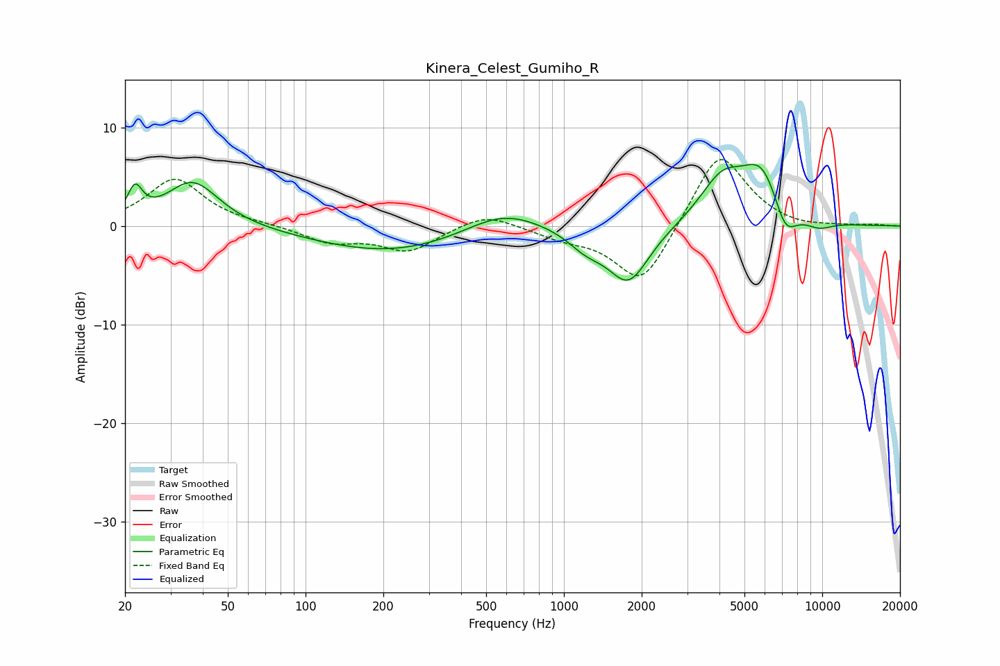

# Kinera_Celest_Gumiho_R
See [usage instructions](https://github.com/jaakkopasanen/AutoEq#usage) for more options and info.

### Parametric EQs
Apply preamp of -6.3 dB when using parametric equalizer.

|   # | Type    |   Fc (Hz) |    Q |   Gain (dB) |
|-----|---------|-----------|------|-------------|
|   1 | Peaking |        22 | 5.07 |         2.9 |
|   2 | Peaking |        37 | 1.39 |         4.6 |
|   3 | Peaking |       216 | 0.47 |        -2.7 |
|   4 | Peaking |       579 | 0.95 |         2.3 |
|   5 | Peaking |      1217 | 1.98 |        -1.6 |
|   6 | Peaking |      1780 | 1.73 |        -5.7 |
|   7 | Peaking |      4085 | 1.62 |         4.3 |
|   8 | Peaking |      5869 | 1.65 |         5.7 |
|   9 | Peaking |      7169 | 2.85 |        -3.6 |
|  10 | Peaking |      9676 | 2.26 |        -0.9 |

### Fixed Band EQs
When using fixed band (also called graphic) equalizer, apply preamp of **-6.8 dB** (if available) and set gains manually with these parameters.

|   # | Type    |   Fc (Hz) |    Q |   Gain (dB) |
|-----|---------|-----------|------|-------------|
|   1 | Peaking |        31 | 1.41 |         4.8 |
|   2 | Peaking |        62 | 1.41 |         0.1 |
|   3 | Peaking |       125 | 1.41 |        -1.6 |
|   4 | Peaking |       250 | 1.41 |        -2.5 |
|   5 | Peaking |       500 | 1.41 |         1.5 |
|   6 | Peaking |      1000 | 1.41 |        -1   |
|   7 | Peaking |      2000 | 1.41 |        -6.2 |
|   8 | Peaking |      4000 | 1.41 |         7.9 |
|   9 | Peaking |      8000 | 1.41 |        -0.3 |
|  10 | Peaking |     16000 | 1.41 |         0.1 |

### Graphs

