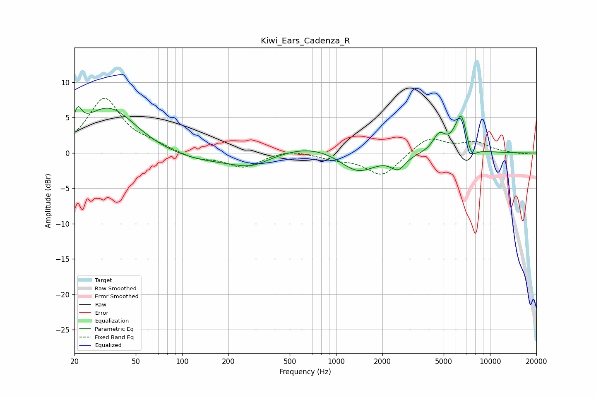

# Kiwi_Ears_Cadenza_R
See [usage instructions](https://github.com/jaakkopasanen/AutoEq#usage) for more options and info.

### Parametric EQs
Apply preamp of -6.7 dB when using parametric equalizer.

|   # | Type    |   Fc (Hz) |    Q |   Gain (dB) |
|-----|---------|-----------|------|-------------|
|   1 | Peaking |        21 | 5.86 |         2.6 |
|   2 | Peaking |        33 | 0.79 |         6.6 |
|   3 | Peaking |       160 | 0.39 |        -1.6 |
|   4 | Peaking |       283 | 1.34 |        -1.1 |
|   5 | Peaking |       665 | 0.66 |         1.5 |
|   6 | Peaking |      1382 | 1.21 |        -2.9 |
|   7 | Peaking |      2532 | 3    |        -1.9 |
|   8 | Peaking |      4675 | 3.44 |         2.3 |
|   9 | Peaking |      6517 | 3.2  |         5.9 |
|  10 | Peaking |      7495 | 3.66 |        -2.5 |

### Fixed Band EQs
When using fixed band (also called graphic) equalizer, apply preamp of **-7.8 dB** (if available) and set gains manually with these parameters.

|   # | Type    |   Fc (Hz) |    Q |   Gain (dB) |
|-----|---------|-----------|------|-------------|
|   1 | Peaking |        31 | 1.41 |         7.6 |
|   2 | Peaking |        62 | 1.41 |         0.9 |
|   3 | Peaking |       125 | 1.41 |        -0.9 |
|   4 | Peaking |       250 | 1.41 |        -2   |
|   5 | Peaking |       500 | 1.41 |         0.6 |
|   6 | Peaking |      1000 | 1.41 |        -0.7 |
|   7 | Peaking |      2000 | 1.41 |        -3.3 |
|   8 | Peaking |      4000 | 1.41 |         2.3 |
|   9 | Peaking |      8000 | 1.41 |         1.4 |
|  10 | Peaking |     16000 | 1.41 |        -0.2 |

### Graphs

