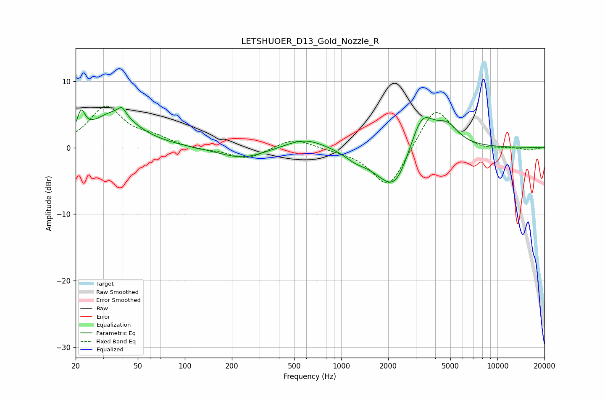

# LETSHUOER_D13_Gold_Nozzle_R
See [usage instructions](https://github.com/jaakkopasanen/AutoEq#usage) for more options and info.

### Parametric EQs
Apply preamp of -6.1 dB when using parametric equalizer.

|   # | Type    |   Fc (Hz) |    Q |   Gain (dB) |
|-----|---------|-----------|------|-------------|
|   1 | Peaking |        22 | 5.95 |         3.1 |
|   2 | Peaking |        35 | 1    |         5   |
|   3 | Peaking |        40 | 5.6  |         1.3 |
|   4 | Peaking |       233 | 0.94 |        -1.7 |
|   5 | Peaking |       590 | 1.09 |         1.7 |
|   6 | Peaking |      1225 | 2.17 |        -0.9 |
|   7 | Peaking |      1848 | 1.04 |        -2.1 |
|   8 | Peaking |      2229 | 1.53 |        -5.2 |
|   9 | Peaking |      3278 | 1.8  |         6.1 |
|  10 | Peaking |      4761 | 1.92 |         2.9 |

### Fixed Band EQs
When using fixed band (also called graphic) equalizer, apply preamp of **-6.3 dB** (if available) and set gains manually with these parameters.

|   # | Type    |   Fc (Hz) |    Q |   Gain (dB) |
|-----|---------|-----------|------|-------------|
|   1 | Peaking |        31 | 1.41 |         6   |
|   2 | Peaking |        62 | 1.41 |         1.2 |
|   3 | Peaking |       125 | 1.41 |        -0.4 |
|   4 | Peaking |       250 | 1.41 |        -1.7 |
|   5 | Peaking |       500 | 1.41 |         1.5 |
|   6 | Peaking |      1000 | 1.41 |        -0.3 |
|   7 | Peaking |      2000 | 1.41 |        -6.4 |
|   8 | Peaking |      4000 | 1.41 |         6.5 |
|   9 | Peaking |      8000 | 1.41 |        -0.5 |
|  10 | Peaking |     16000 | 1.41 |        -0.4 |

### Graphs

