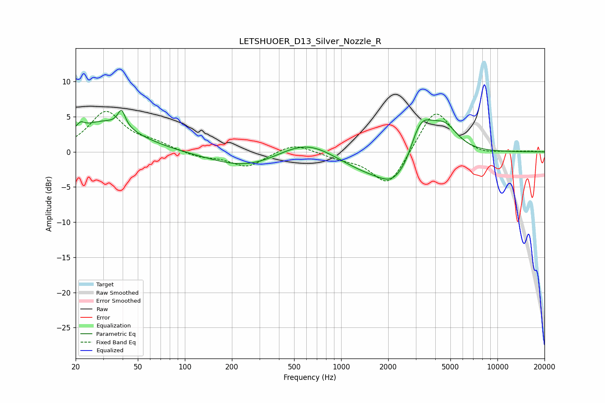

# LETSHUOER_D13_Silver_Nozzle_R
See [usage instructions](https://github.com/jaakkopasanen/AutoEq#usage) for more options and info.

### Parametric EQs
Apply preamp of -6.0 dB when using parametric equalizer.

|   # | Type    |   Fc (Hz) |    Q |   Gain (dB) |
|-----|---------|-----------|------|-------------|
|   1 | Peaking |        21 | 6    |         0.9 |
|   2 | Peaking |        30 | 0.71 |         4.2 |
|   3 | Peaking |        39 | 6    |         2.3 |
|   4 | Peaking |       253 | 0.61 |        -2.4 |
|   5 | Peaking |       605 | 0.75 |         2.9 |
|   6 | Peaking |      1831 | 0.53 |        -3.9 |
|   7 | Peaking |      2141 | 1.81 |        -2   |
|   8 | Peaking |      2620 | 2.45 |        -1.3 |
|   9 | Peaking |      3223 | 1.69 |         6.3 |
|  10 | Peaking |      4603 | 1.6  |         3.7 |

### Fixed Band EQs
When using fixed band (also called graphic) equalizer, apply preamp of **-5.8 dB** (if available) and set gains manually with these parameters.

|   # | Type    |   Fc (Hz) |    Q |   Gain (dB) |
|-----|---------|-----------|------|-------------|
|   1 | Peaking |        31 | 1.41 |         5.6 |
|   2 | Peaking |        62 | 1.41 |         1   |
|   3 | Peaking |       125 | 1.41 |        -0.7 |
|   4 | Peaking |       250 | 1.41 |        -2.1 |
|   5 | Peaking |       500 | 1.41 |         1.3 |
|   6 | Peaking |      1000 | 1.41 |        -0.7 |
|   7 | Peaking |      2000 | 1.41 |        -5.1 |
|   8 | Peaking |      4000 | 1.41 |         6.3 |
|   9 | Peaking |      8000 | 1.41 |        -0.6 |
|  10 | Peaking |     16000 | 1.41 |         0.1 |

### Graphs

