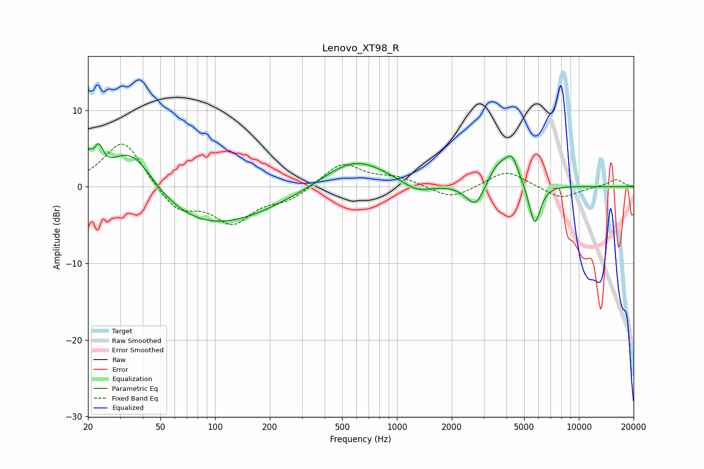

# Lenovo_XT98_R
See [usage instructions](https://github.com/jaakkopasanen/AutoEq#usage) for more options and info.

### Parametric EQs
Apply preamp of -5.7 dB when using parametric equalizer.

|   # | Type    |   Fc (Hz) |    Q |   Gain (dB) |
|-----|---------|-----------|------|-------------|
|   1 | Peaking |        20 | 6    |         2.7 |
|   2 | Peaking |        23 | 5.83 |         2.9 |
|   3 | Peaking |        35 | 1.08 |         6.9 |
|   4 | Peaking |        89 | 0.4  |        -5.6 |
|   5 | Peaking |       586 | 0.8  |         3.9 |
|   6 | Peaking |      1288 | 1.68 |        -1.4 |
|   7 | Peaking |      2725 | 2.55 |        -3.8 |
|   8 | Peaking |      3676 | 1.7  |         3.8 |
|   9 | Peaking |      4310 | 4.35 |         2.2 |
|  10 | Peaking |      5714 | 4.26 |        -5.7 |

### Fixed Band EQs
When using fixed band (also called graphic) equalizer, apply preamp of **-5.7 dB** (if available) and set gains manually with these parameters.

|   # | Type    |   Fc (Hz) |    Q |   Gain (dB) |
|-----|---------|-----------|------|-------------|
|   1 | Peaking |        31 | 1.41 |         6.3 |
|   2 | Peaking |        62 | 1.41 |        -3.2 |
|   3 | Peaking |       125 | 1.41 |        -4.4 |
|   4 | Peaking |       250 | 1.41 |        -1.6 |
|   5 | Peaking |       500 | 1.41 |         3.2 |
|   6 | Peaking |      1000 | 1.41 |         1.1 |
|   7 | Peaking |      2000 | 1.41 |        -1.7 |
|   8 | Peaking |      4000 | 1.41 |         2.2 |
|   9 | Peaking |      8000 | 1.41 |        -1.6 |
|  10 | Peaking |     16000 | 1.41 |         1   |

### Graphs

