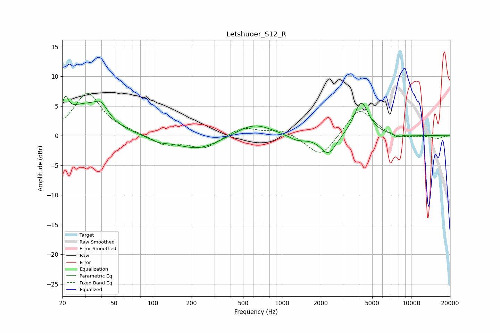

# Letshuoer_S12_R
See [usage instructions](https://github.com/jaakkopasanen/AutoEq#usage) for more options and info.

### Parametric EQs
Apply preamp of -6.8 dB when using parametric equalizer.

|   # | Type    |   Fc (Hz) |    Q |   Gain (dB) |
|-----|---------|-----------|------|-------------|
|   1 | Peaking |        21 | 5.9  |         3   |
|   2 | Peaking |        29 | 0.94 |         4.7 |
|   3 | Peaking |        40 | 2.61 |         2.4 |
|   4 | Peaking |       110 | 1.87 |        -0.8 |
|   5 | Peaking |       224 | 0.83 |        -2.3 |
|   6 | Peaking |       605 | 1.01 |         2.2 |
|   7 | Peaking |      1315 | 2.06 |        -0.9 |
|   8 | Peaking |      2288 | 2.29 |        -3.4 |
|   9 | Peaking |      4113 | 2.44 |         5.8 |
|  10 | Peaking |      7846 | 4.69 |        -0.5 |

### Fixed Band EQs
When using fixed band (also called graphic) equalizer, apply preamp of **-7.2 dB** (if available) and set gains manually with these parameters.

|   # | Type    |   Fc (Hz) |    Q |   Gain (dB) |
|-----|---------|-----------|------|-------------|
|   1 | Peaking |        31 | 1.41 |         7.1 |
|   2 | Peaking |        62 | 1.41 |         0.4 |
|   3 | Peaking |       125 | 1.41 |        -1.6 |
|   4 | Peaking |       250 | 1.41 |        -2.1 |
|   5 | Peaking |       500 | 1.41 |         1.5 |
|   6 | Peaking |      1000 | 1.41 |         1.1 |
|   7 | Peaking |      2000 | 1.41 |        -3.8 |
|   8 | Peaking |      4000 | 1.41 |         4.8 |
|   9 | Peaking |      8000 | 1.41 |        -0.6 |
|  10 | Peaking |     16000 | 1.41 |        -0.5 |

### Graphs

