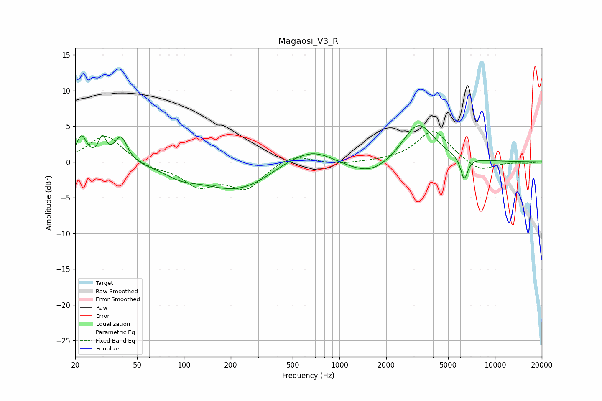

# Magaosi_V3_R
See [usage instructions](https://github.com/jaakkopasanen/AutoEq#usage) for more options and info.

### Parametric EQs
Apply preamp of -5.2 dB when using parametric equalizer.

|   # | Type    |   Fc (Hz) |    Q |   Gain (dB) |
|-----|---------|-----------|------|-------------|
|   1 | Peaking |        22 | 4.31 |         3.4 |
|   2 | Peaking |        30 | 6    |         2.8 |
|   3 | Peaking |        39 | 3.52 |         3.6 |
|   4 | Peaking |        95 | 1.46 |        -1.1 |
|   5 | Peaking |       220 | 0.59 |        -3.9 |
|   6 | Peaking |       447 | 1.19 |         0.8 |
|   7 | Peaking |       676 | 1.08 |         2.2 |
|   8 | Peaking |      1593 | 0.97 |        -2.2 |
|   9 | Peaking |      3208 | 1.36 |         5.7 |
|  10 | Peaking |      6341 | 5.92 |        -3.2 |

### Fixed Band EQs
When using fixed band (also called graphic) equalizer, apply preamp of **-4.3 dB** (if available) and set gains manually with these parameters.

|   # | Type    |   Fc (Hz) |    Q |   Gain (dB) |
|-----|---------|-----------|------|-------------|
|   1 | Peaking |        31 | 1.41 |         3.9 |
|   2 | Peaking |        62 | 1.41 |        -0.8 |
|   3 | Peaking |       125 | 1.41 |        -3.1 |
|   4 | Peaking |       250 | 1.41 |        -3.5 |
|   5 | Peaking |       500 | 1.41 |         1.3 |
|   6 | Peaking |      1000 | 1.41 |        -0.3 |
|   7 | Peaking |      2000 | 1.41 |         0.1 |
|   8 | Peaking |      4000 | 1.41 |         4.5 |
|   9 | Peaking |      8000 | 1.41 |        -1.5 |
|  10 | Peaking |     16000 | 1.41 |        -0.2 |

### Graphs

