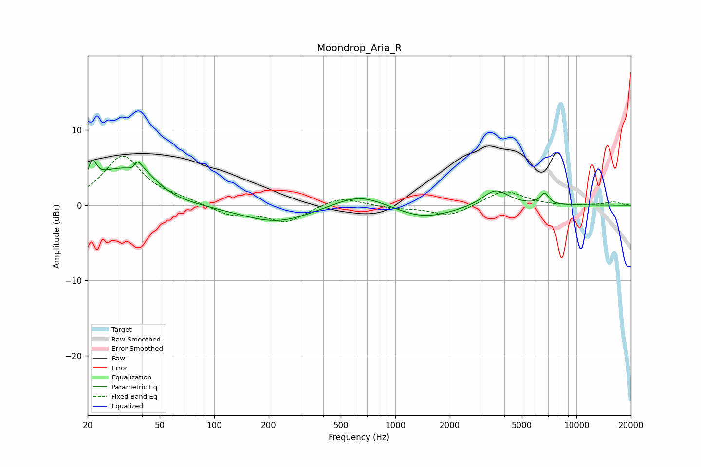

# Moondrop_Aria_R
See [usage instructions](https://github.com/jaakkopasanen/AutoEq#usage) for more options and info.

### Parametric EQs
Apply preamp of -6.1 dB when using parametric equalizer.

|   # | Type    |   Fc (Hz) |    Q |   Gain (dB) |
|-----|---------|-----------|------|-------------|
|   1 | Peaking |        21 | 5.98 |         3.1 |
|   2 | Peaking |        27 | 1.34 |         2.9 |
|   3 | Peaking |        36 | 5.93 |        -2.1 |
|   4 | Peaking |        37 | 5.87 |         2.7 |
|   5 | Peaking |        39 | 1.44 |         3.5 |
|   6 | Peaking |       222 | 0.71 |        -2.3 |
|   7 | Peaking |       634 | 0.96 |         1.9 |
|   8 | Peaking |      1430 | 0.87 |        -1.8 |
|   9 | Peaking |      3575 | 1.97 |         2.2 |
|  10 | Peaking |      6669 | 6    |         1.5 |

### Fixed Band EQs
When using fixed band (also called graphic) equalizer, apply preamp of **-6.6 dB** (if available) and set gains manually with these parameters.

|   # | Type    |   Fc (Hz) |    Q |   Gain (dB) |
|-----|---------|-----------|------|-------------|
|   1 | Peaking |        31 | 1.41 |         6.5 |
|   2 | Peaking |        62 | 1.41 |         0.6 |
|   3 | Peaking |       125 | 1.41 |        -1.3 |
|   4 | Peaking |       250 | 1.41 |        -2.2 |
|   5 | Peaking |       500 | 1.41 |         1.2 |
|   6 | Peaking |      1000 | 1.41 |        -0.4 |
|   7 | Peaking |      2000 | 1.41 |        -1.5 |
|   8 | Peaking |      4000 | 1.41 |         2.1 |
|   9 | Peaking |      8000 | 1.41 |        -0.1 |
|  10 | Peaking |     16000 | 1.41 |         0.4 |

### Graphs

