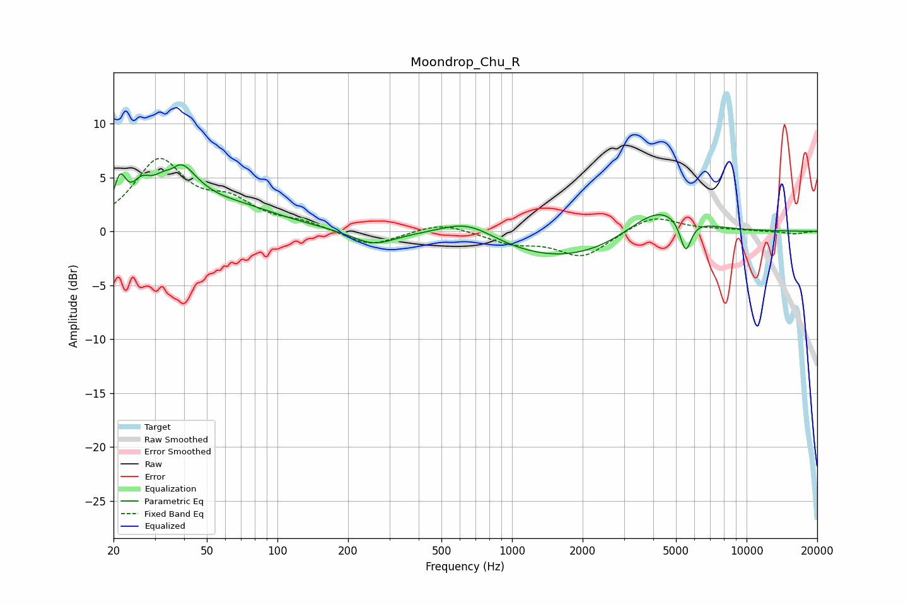

# Moondrop_Chu_R
See [usage instructions](https://github.com/jaakkopasanen/AutoEq#usage) for more options and info.

### Parametric EQs
Apply preamp of -6.3 dB when using parametric equalizer.

|   # | Type    |   Fc (Hz) |    Q |   Gain (dB) |
|-----|---------|-----------|------|-------------|
|   1 | Peaking |        21 | 5.58 |         3.3 |
|   2 | Peaking |        26 | 3.78 |         1.8 |
|   3 | Peaking |        36 | 4.14 |        -1.4 |
|   4 | Peaking |        37 | 1.79 |         5.9 |
|   5 | Peaking |        65 | 0.71 |         1.9 |
|   6 | Peaking |       256 | 1.53 |        -1.3 |
|   7 | Peaking |       646 | 1.17 |         1.8 |
|   8 | Peaking |      1704 | 0.46 |        -2.8 |
|   9 | Peaking |      4238 | 1    |         3.2 |
|  10 | Peaking |      5498 | 5.72 |        -3.1 |

### Fixed Band EQs
When using fixed band (also called graphic) equalizer, apply preamp of **-6.9 dB** (if available) and set gains manually with these parameters.

|   # | Type    |   Fc (Hz) |    Q |   Gain (dB) |
|-----|---------|-----------|------|-------------|
|   1 | Peaking |        31 | 1.41 |         6.3 |
|   2 | Peaking |        62 | 1.41 |         2.3 |
|   3 | Peaking |       125 | 1.41 |         0.7 |
|   4 | Peaking |       250 | 1.41 |        -1.4 |
|   5 | Peaking |       500 | 1.41 |         0.9 |
|   6 | Peaking |      1000 | 1.41 |        -1   |
|   7 | Peaking |      2000 | 1.41 |        -2.3 |
|   8 | Peaking |      4000 | 1.41 |         1.5 |
|   9 | Peaking |      8000 | 1.41 |         0.1 |
|  10 | Peaking |     16000 | 1.41 |        -0.3 |

### Graphs

