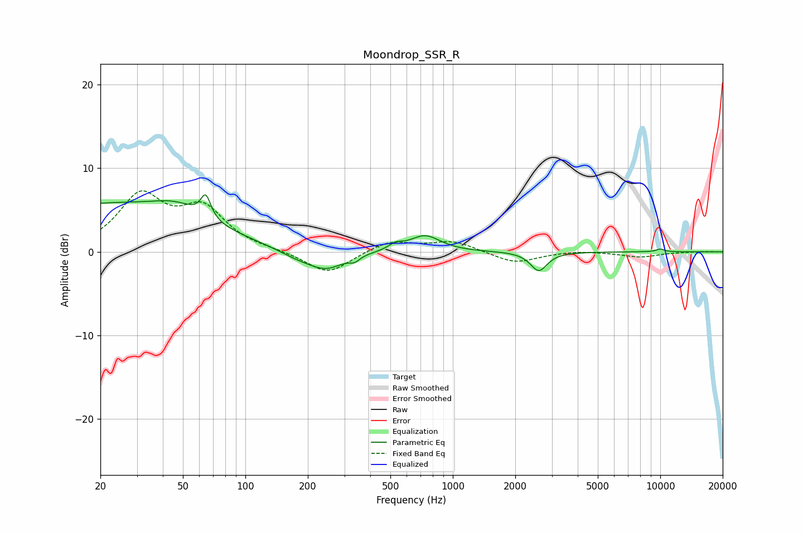

# Moondrop_SSR_R
See [usage instructions](https://github.com/jaakkopasanen/AutoEq#usage) for more options and info.

### Parametric EQs
Apply preamp of -6.9 dB when using parametric equalizer.

|   # | Type    |   Fc (Hz) |    Q |   Gain (dB) |
|-----|---------|-----------|------|-------------|
|   1 | Peaking |        20 | 0.29 |         5.6 |
|   2 | Peaking |        47 | 1.21 |         1.7 |
|   3 | Peaking |        64 | 6    |         2.7 |
|   4 | Peaking |       177 | 1.4  |        -0.9 |
|   5 | Peaking |       245 | 1.61 |        -2   |
|   6 | Peaking |       336 | 5.89 |        -0.6 |
|   7 | Peaking |       530 | 4.31 |         0.7 |
|   8 | Peaking |       734 | 1.91 |         2   |
|   9 | Peaking |      2597 | 3.59 |        -2.3 |
|  10 | Peaking |     10000 | 5.88 |         0.3 |

### Fixed Band EQs
When using fixed band (also called graphic) equalizer, apply preamp of **-7.4 dB** (if available) and set gains manually with these parameters.

|   # | Type    |   Fc (Hz) |    Q |   Gain (dB) |
|-----|---------|-----------|------|-------------|
|   1 | Peaking |        31 | 1.41 |         6.4 |
|   2 | Peaking |        62 | 1.41 |         4.8 |
|   3 | Peaking |       125 | 1.41 |         0.1 |
|   4 | Peaking |       250 | 1.41 |        -2.7 |
|   5 | Peaking |       500 | 1.41 |         1.3 |
|   6 | Peaking |      1000 | 1.41 |         1.3 |
|   7 | Peaking |      2000 | 1.41 |        -1.4 |
|   8 | Peaking |      4000 | 1.41 |         0.2 |
|   9 | Peaking |      8000 | 1.41 |        -0.6 |
|  10 | Peaking |     16000 | 1.41 |         0   |

### Graphs

