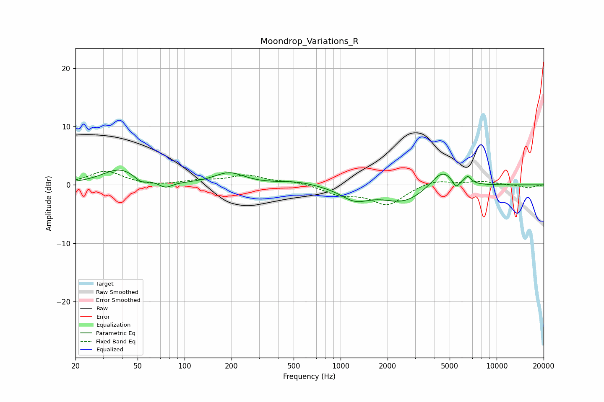

# Moondrop_Variations_R
See [usage instructions](https://github.com/jaakkopasanen/AutoEq#usage) for more options and info.

### Parametric EQs
Apply preamp of -2.6 dB when using parametric equalizer.

|   # | Type    |   Fc (Hz) |    Q |   Gain (dB) |
|-----|---------|-----------|------|-------------|
|   1 | Peaking |        38 | 1.26 |         2.7 |
|   2 | Peaking |        52 | 3.8  |        -1   |
|   3 | Peaking |        76 | 3.34 |        -1.1 |
|   4 | Peaking |       193 | 1.45 |         2   |
|   5 | Peaking |       528 | 1.16 |         0.6 |
|   6 | Peaking |      1238 | 1.52 |        -2.2 |
|   7 | Peaking |      2535 | 1.04 |        -2.8 |
|   8 | Peaking |      4487 | 1.93 |         3.1 |
|   9 | Peaking |      5488 | 5.94 |        -1.5 |
|  10 | Peaking |      6528 | 6    |         1.3 |

### Fixed Band EQs
When using fixed band (also called graphic) equalizer, apply preamp of **-2.4 dB** (if available) and set gains manually with these parameters.

|   # | Type    |   Fc (Hz) |    Q |   Gain (dB) |
|-----|---------|-----------|------|-------------|
|   1 | Peaking |        31 | 1.41 |         2.4 |
|   2 | Peaking |        62 | 1.41 |        -0.3 |
|   3 | Peaking |       125 | 1.41 |         0.6 |
|   4 | Peaking |       250 | 1.41 |         1.6 |
|   5 | Peaking |       500 | 1.41 |         0.5 |
|   6 | Peaking |      1000 | 1.41 |        -1.5 |
|   7 | Peaking |      2000 | 1.41 |        -3.3 |
|   8 | Peaking |      4000 | 1.41 |         1   |
|   9 | Peaking |      8000 | 1.41 |         0.6 |
|  10 | Peaking |     16000 | 1.41 |        -0.5 |

### Graphs

