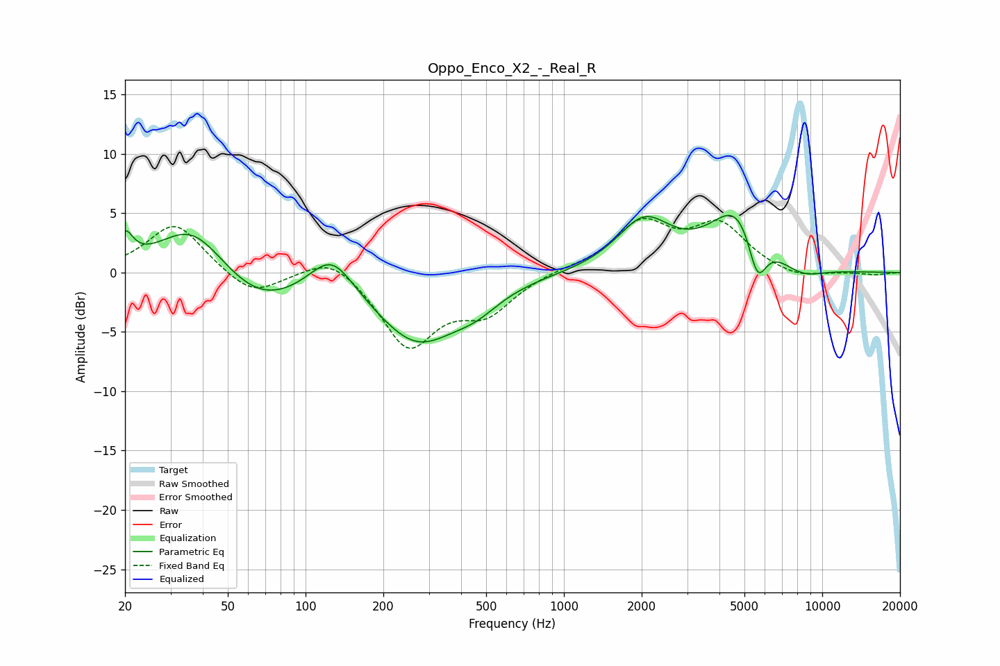

# Oppo_Enco_X2_-_Real_R
See [usage instructions](https://github.com/jaakkopasanen/AutoEq#usage) for more options and info.

### Parametric EQs
Apply preamp of -4.9 dB when using parametric equalizer.

|   # | Type    |   Fc (Hz) |    Q |   Gain (dB) |
|-----|---------|-----------|------|-------------|
|   1 | Peaking |        20 | 4.72 |         2.4 |
|   2 | Peaking |        36 | 1.07 |         4.5 |
|   3 | Peaking |        65 | 0.84 |        -3   |
|   4 | Peaking |       126 | 1.64 |         3.4 |
|   5 | Peaking |       270 | 0.87 |        -5.7 |
|   6 | Peaking |       457 | 1.52 |        -1.3 |
|   7 | Peaking |      2040 | 1.36 |         4.2 |
|   8 | Peaking |      4760 | 1.3  |         5.5 |
|   9 | Peaking |      5605 | 3.71 |        -4.3 |
|  10 | Peaking |      8270 | 1.5  |        -1.1 |

### Fixed Band EQs
When using fixed band (also called graphic) equalizer, apply preamp of **-4.7 dB** (if available) and set gains manually with these parameters.

|   # | Type    |   Fc (Hz) |    Q |   Gain (dB) |
|-----|---------|-----------|------|-------------|
|   1 | Peaking |        31 | 1.41 |         4.2 |
|   2 | Peaking |        62 | 1.41 |        -2.1 |
|   3 | Peaking |       125 | 1.41 |         1.8 |
|   4 | Peaking |       250 | 1.41 |        -6.1 |
|   5 | Peaking |       500 | 1.41 |        -3   |
|   6 | Peaking |      1000 | 1.41 |         0.3 |
|   7 | Peaking |      2000 | 1.41 |         4   |
|   8 | Peaking |      4000 | 1.41 |         3.8 |
|   9 | Peaking |      8000 | 1.41 |        -0.6 |
|  10 | Peaking |     16000 | 1.41 |        -0.2 |

### Graphs

