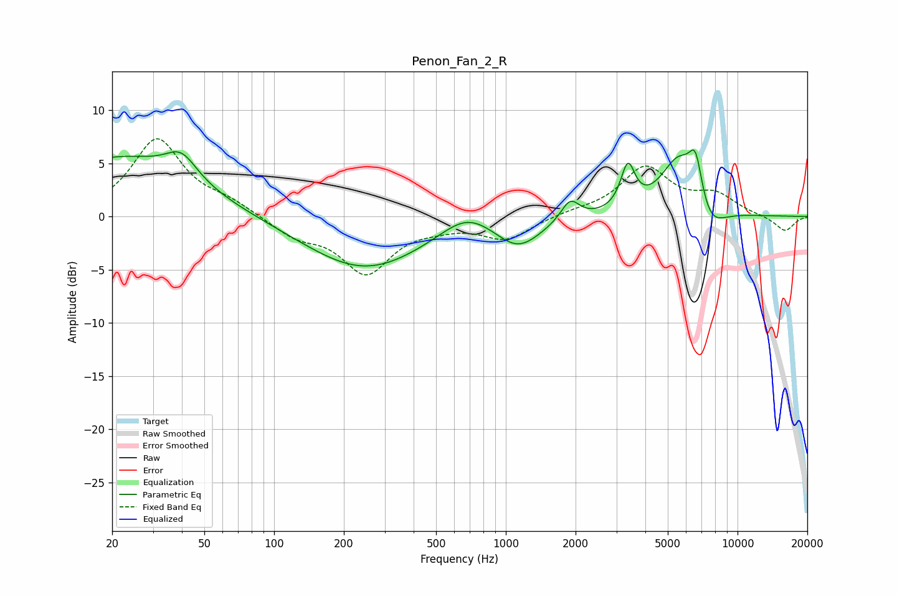

# Penon_Fan_2_R
See [usage instructions](https://github.com/jaakkopasanen/AutoEq#usage) for more options and info.

### Parametric EQs
Apply preamp of -6.3 dB when using parametric equalizer.

|   # | Type    |   Fc (Hz) |    Q |   Gain (dB) |
|-----|---------|-----------|------|-------------|
|   1 | Peaking |        21 | 0.45 |         5.5 |
|   2 | Peaking |        40 | 2.12 |         2.4 |
|   3 | Peaking |       246 | 0.54 |        -5   |
|   4 | Peaking |       679 | 1.27 |         2.1 |
|   5 | Peaking |      1133 | 1.42 |        -2.7 |
|   6 | Peaking |      1895 | 3.59 |         2   |
|   7 | Peaking |      3364 | 4.65 |         4.1 |
|   8 | Peaking |      5575 | 1.73 |         5.4 |
|   9 | Peaking |      6594 | 4.67 |         4.1 |
|  10 | Peaking |      7503 | 2.03 |        -2.7 |

### Fixed Band EQs
When using fixed band (also called graphic) equalizer, apply preamp of **-7.4 dB** (if available) and set gains manually with these parameters.

|   # | Type    |   Fc (Hz) |    Q |   Gain (dB) |
|-----|---------|-----------|------|-------------|
|   1 | Peaking |        31 | 1.41 |         7.2 |
|   2 | Peaking |        62 | 1.41 |         1.1 |
|   3 | Peaking |       125 | 1.41 |        -1.7 |
|   4 | Peaking |       250 | 1.41 |        -5.1 |
|   5 | Peaking |       500 | 1.41 |        -0.6 |
|   6 | Peaking |      1000 | 1.41 |        -2.1 |
|   7 | Peaking |      2000 | 1.41 |         0.4 |
|   8 | Peaking |      4000 | 1.41 |         4.5 |
|   9 | Peaking |      8000 | 1.41 |         1.8 |
|  10 | Peaking |     16000 | 1.41 |        -1.4 |

### Graphs

