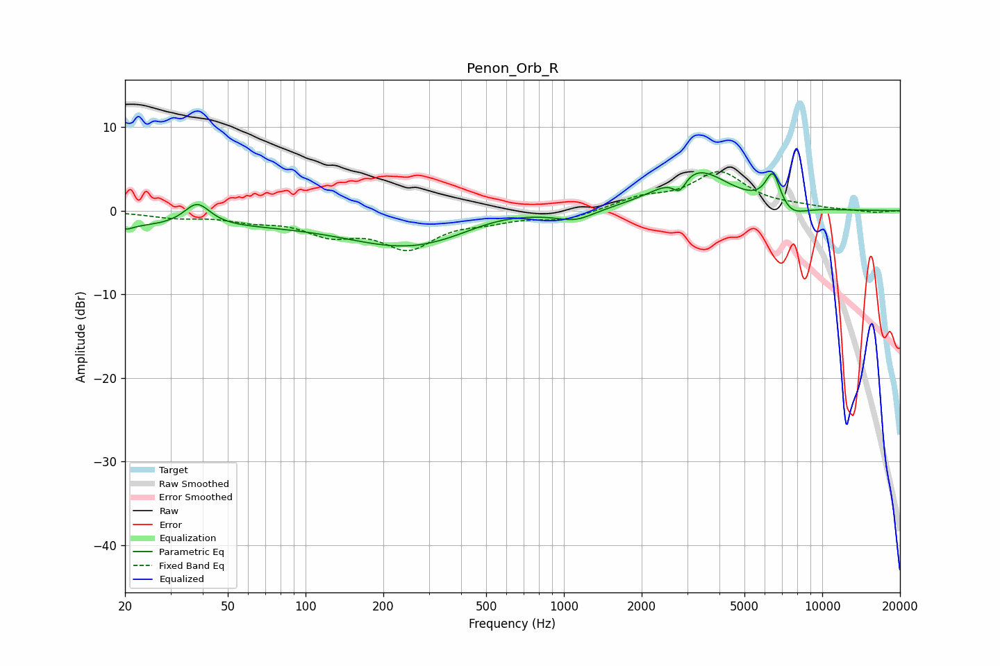

# Penon_Orb_R
See [usage instructions](https://github.com/jaakkopasanen/AutoEq#usage) for more options and info.

### Parametric EQs
Apply preamp of -4.6 dB when using parametric equalizer.

|   # | Type    |   Fc (Hz) |    Q |   Gain (dB) |
|-----|---------|-----------|------|-------------|
|   1 | Peaking |        20 | 0.21 |        -1.8 |
|   2 | Peaking |        20 | 5    |        -0.5 |
|   3 | Peaking |        38 | 2.84 |         2.7 |
|   4 | Peaking |       262 | 0.54 |        -4.3 |
|   5 | Peaking |       548 | 0.91 |         1.1 |
|   6 | Peaking |      1112 | 1.98 |        -1.2 |
|   7 | Peaking |      2803 | 5.52 |        -1.9 |
|   8 | Peaking |      3231 | 1.11 |         5   |
|   9 | Peaking |      6449 | 4.63 |         4.1 |
|  10 | Peaking |      7511 | 2.29 |        -1.4 |

### Fixed Band EQs
When using fixed band (also called graphic) equalizer, apply preamp of **-4.8 dB** (if available) and set gains manually with these parameters.

|   # | Type    |   Fc (Hz) |    Q |   Gain (dB) |
|-----|---------|-----------|------|-------------|
|   1 | Peaking |        31 | 1.41 |        -0.7 |
|   2 | Peaking |        62 | 1.41 |        -0.9 |
|   3 | Peaking |       125 | 1.41 |        -2.4 |
|   4 | Peaking |       250 | 1.41 |        -4.1 |
|   5 | Peaking |       500 | 1.41 |        -0.9 |
|   6 | Peaking |      1000 | 1.41 |        -1.1 |
|   7 | Peaking |      2000 | 1.41 |         1.3 |
|   8 | Peaking |      4000 | 1.41 |         4.4 |
|   9 | Peaking |      8000 | 1.41 |         0.3 |
|  10 | Peaking |     16000 | 1.41 |        -0.2 |

### Graphs

