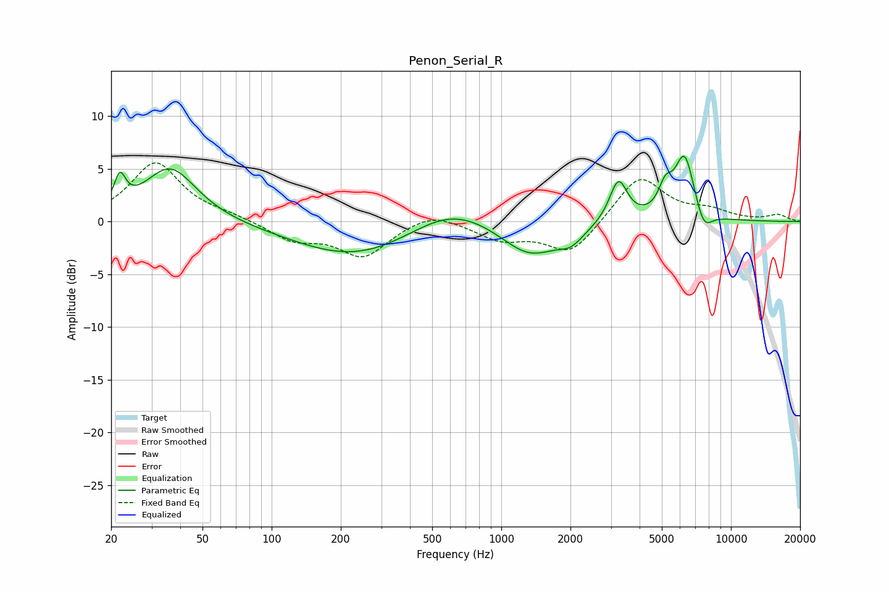

# Penon_Serial_R
See [usage instructions](https://github.com/jaakkopasanen/AutoEq#usage) for more options and info.

### Parametric EQs
Apply preamp of -6.3 dB when using parametric equalizer.

|   # | Type    |   Fc (Hz) |    Q |   Gain (dB) |
|-----|---------|-----------|------|-------------|
|   1 | Peaking |        22 | 5.81 |         2.8 |
|   2 | Peaking |        36 | 1.23 |         5.2 |
|   3 | Peaking |       236 | 0.51 |        -3.5 |
|   4 | Peaking |       600 | 0.77 |         2.5 |
|   5 | Peaking |      1333 | 1.1  |        -3.3 |
|   6 | Peaking |      2012 | 2.62 |        -1.2 |
|   7 | Peaking |      3235 | 3.59 |         4.1 |
|   8 | Peaking |      5172 | 4.73 |         2.2 |
|   9 | Peaking |      6282 | 3.05 |         6.3 |
|  10 | Peaking |      7598 | 3.67 |        -2.1 |

### Fixed Band EQs
When using fixed band (also called graphic) equalizer, apply preamp of **-5.7 dB** (if available) and set gains manually with these parameters.

|   # | Type    |   Fc (Hz) |    Q |   Gain (dB) |
|-----|---------|-----------|------|-------------|
|   1 | Peaking |        31 | 1.41 |         5.6 |
|   2 | Peaking |        62 | 1.41 |         0.5 |
|   3 | Peaking |       125 | 1.41 |        -1.7 |
|   4 | Peaking |       250 | 1.41 |        -3.2 |
|   5 | Peaking |       500 | 1.41 |         1.1 |
|   6 | Peaking |      1000 | 1.41 |        -1.6 |
|   7 | Peaking |      2000 | 1.41 |        -3.1 |
|   8 | Peaking |      4000 | 1.41 |         4.4 |
|   9 | Peaking |      8000 | 1.41 |         0.9 |
|  10 | Peaking |     16000 | 1.41 |         0.6 |

### Graphs

