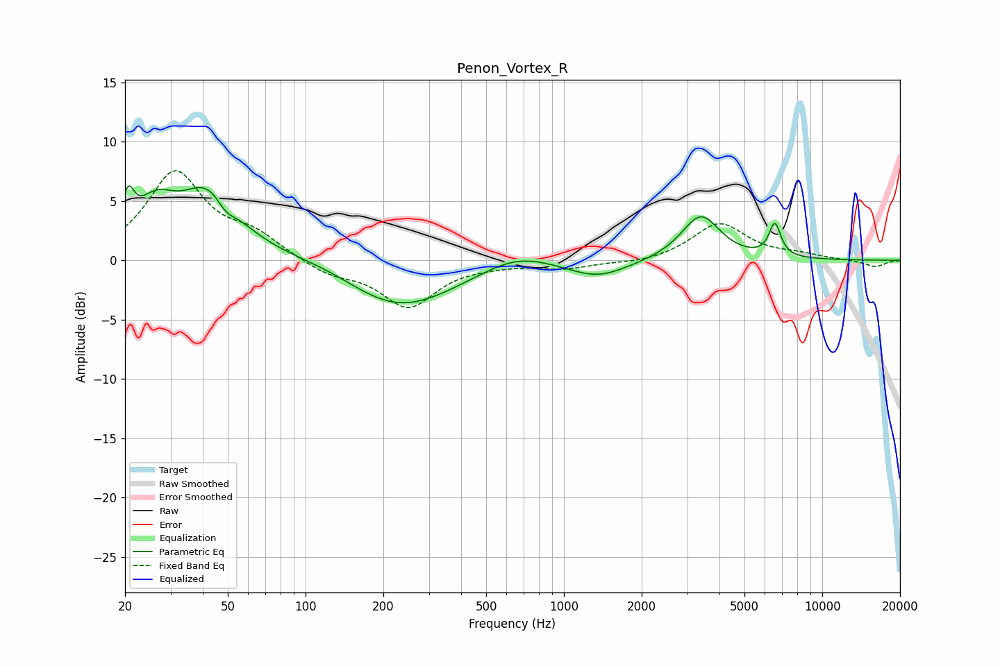

# Penon_Vortex_R
See [usage instructions](https://github.com/jaakkopasanen/AutoEq#usage) for more options and info.

### Parametric EQs
Apply preamp of -6.4 dB when using parametric equalizer.

|   # | Type    |   Fc (Hz) |    Q |   Gain (dB) |
|-----|---------|-----------|------|-------------|
|   1 | Peaking |        21 | 5.85 |         3.2 |
|   2 | Peaking |        26 | 1.87 |         3.4 |
|   3 | Peaking |        42 | 1.25 |         5.7 |
|   4 | Peaking |        49 | 3.79 |        -1.2 |
|   5 | Peaking |       124 | 0.71 |         1.2 |
|   6 | Peaking |       223 | 0.62 |        -4.5 |
|   7 | Peaking |       652 | 1.04 |         1.3 |
|   8 | Peaking |      1351 | 1.21 |        -1.5 |
|   9 | Peaking |      3384 | 1.89 |         3.8 |
|  10 | Peaking |      6554 | 6    |         2.8 |

### Fixed Band EQs
When using fixed band (also called graphic) equalizer, apply preamp of **-7.6 dB** (if available) and set gains manually with these parameters.

|   # | Type    |   Fc (Hz) |    Q |   Gain (dB) |
|-----|---------|-----------|------|-------------|
|   1 | Peaking |        31 | 1.41 |         7.3 |
|   2 | Peaking |        62 | 1.41 |         1.8 |
|   3 | Peaking |       125 | 1.41 |        -1.1 |
|   4 | Peaking |       250 | 1.41 |        -3.8 |
|   5 | Peaking |       500 | 1.41 |        -0.2 |
|   6 | Peaking |      1000 | 1.41 |        -0.6 |
|   7 | Peaking |      2000 | 1.41 |        -0.3 |
|   8 | Peaking |      4000 | 1.41 |         3.1 |
|   9 | Peaking |      8000 | 1.41 |         0.4 |
|  10 | Peaking |     16000 | 1.41 |        -0.6 |

### Graphs

