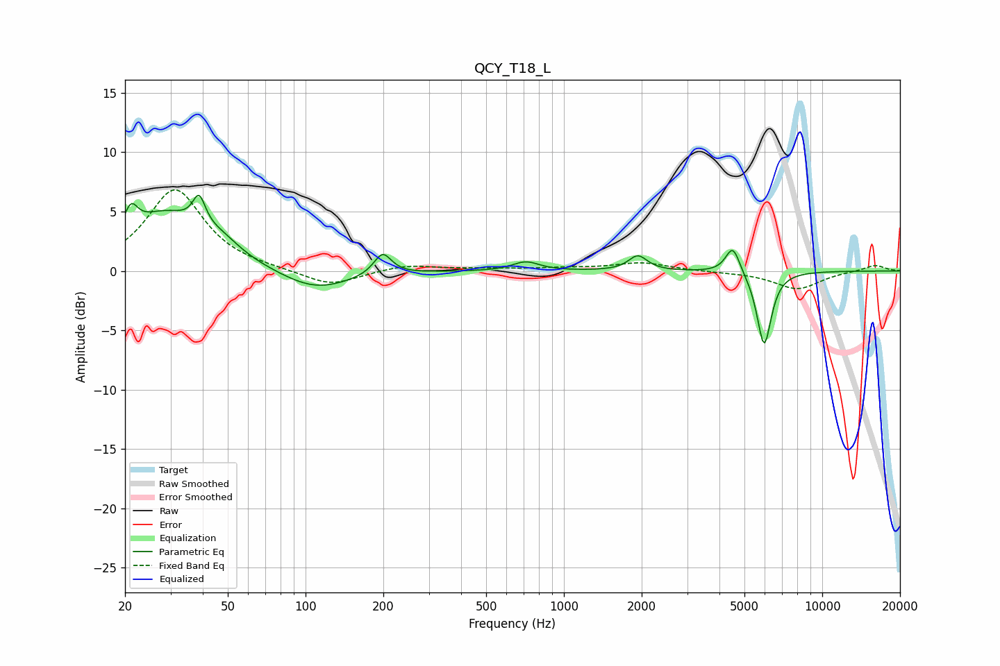

# QCY_T18_L
See [usage instructions](https://github.com/jaakkopasanen/AutoEq#usage) for more options and info.

### Parametric EQs
Apply preamp of -6.5 dB when using parametric equalizer.

|   # | Type    |   Fc (Hz) |    Q |   Gain (dB) |
|-----|---------|-----------|------|-------------|
|   1 | Peaking |        21 | 5.42 |         2.1 |
|   2 | Peaking |        29 | 0.94 |         4.7 |
|   3 | Peaking |        39 | 5.9  |         2.4 |
|   4 | Peaking |        47 | 1.92 |         1.1 |
|   5 | Peaking |       109 | 1.05 |        -1.7 |
|   6 | Peaking |       199 | 4.17 |         1.9 |
|   7 | Peaking |       712 | 2.79 |         0.8 |
|   8 | Peaking |      1934 | 3.97 |         1.3 |
|   9 | Peaking |      4508 | 5.06 |         2.3 |
|  10 | Peaking |      5959 | 4.98 |        -6.3 |

### Fixed Band EQs
When using fixed band (also called graphic) equalizer, apply preamp of **-6.9 dB** (if available) and set gains manually with these parameters.

|   # | Type    |   Fc (Hz) |    Q |   Gain (dB) |
|-----|---------|-----------|------|-------------|
|   1 | Peaking |        31 | 1.41 |         6.9 |
|   2 | Peaking |        62 | 1.41 |         0.1 |
|   3 | Peaking |       125 | 1.41 |        -1.3 |
|   4 | Peaking |       250 | 1.41 |         0.5 |
|   5 | Peaking |       500 | 1.41 |         0.2 |
|   6 | Peaking |      1000 | 1.41 |         0.2 |
|   7 | Peaking |      2000 | 1.41 |         0.7 |
|   8 | Peaking |      4000 | 1.41 |        -0.1 |
|   9 | Peaking |      8000 | 1.41 |        -1.5 |
|  10 | Peaking |     16000 | 1.41 |         0.5 |

### Graphs

