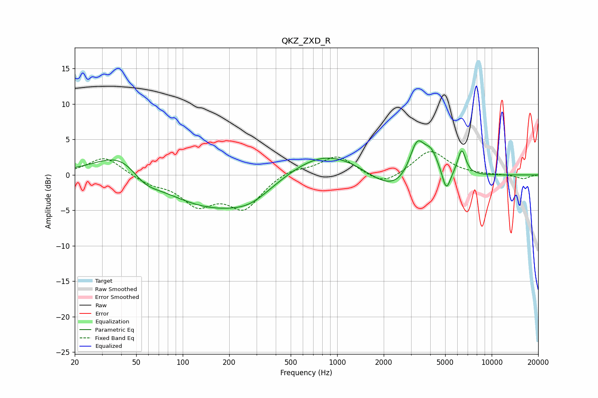

# QKZ_ZXD_R
See [usage instructions](https://github.com/jaakkopasanen/AutoEq#usage) for more options and info.

### Parametric EQs
Apply preamp of -4.9 dB when using parametric equalizer.

|   # | Type    |   Fc (Hz) |    Q |   Gain (dB) |
|-----|---------|-----------|------|-------------|
|   1 | Peaking |        44 | 0.8  |         5.5 |
|   2 | Peaking |        55 | 1.3  |        -3.3 |
|   3 | Peaking |       162 | 0.38 |        -5.2 |
|   4 | Peaking |       275 | 1.21 |        -1.1 |
|   5 | Peaking |       829 | 0.51 |         4.3 |
|   6 | Peaking |      2336 | 0.81 |        -3.6 |
|   7 | Peaking |      3286 | 2.72 |         5.5 |
|   8 | Peaking |      4069 | 2.93 |         3   |
|   9 | Peaking |      5086 | 5.28 |        -3   |
|  10 | Peaking |      6396 | 5.1  |         3.6 |

### Fixed Band EQs
When using fixed band (also called graphic) equalizer, apply preamp of **-3.4 dB** (if available) and set gains manually with these parameters.

|   # | Type    |   Fc (Hz) |    Q |   Gain (dB) |
|-----|---------|-----------|------|-------------|
|   1 | Peaking |        31 | 1.41 |         2.6 |
|   2 | Peaking |        62 | 1.41 |        -1.1 |
|   3 | Peaking |       125 | 1.41 |        -3.8 |
|   4 | Peaking |       250 | 1.41 |        -4.5 |
|   5 | Peaking |       500 | 1.41 |         0.9 |
|   6 | Peaking |      1000 | 1.41 |         2.7 |
|   7 | Peaking |      2000 | 1.41 |        -1.6 |
|   8 | Peaking |      4000 | 1.41 |         3.5 |
|   9 | Peaking |      8000 | 1.41 |         0   |
|  10 | Peaking |     16000 | 1.41 |        -0.6 |

### Graphs

