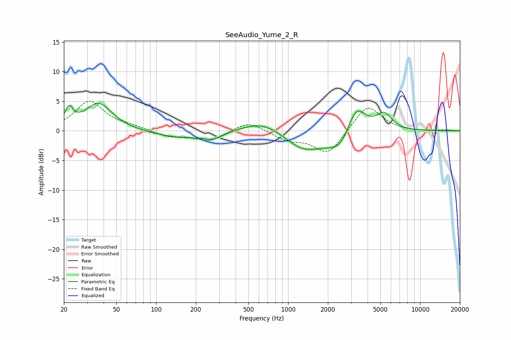

# SeeAudio_Yume_2_R
See [usage instructions](https://github.com/jaakkopasanen/AutoEq#usage) for more options and info.

### Parametric EQs
Apply preamp of -4.7 dB when using parametric equalizer.

|   # | Type    |   Fc (Hz) |    Q |   Gain (dB) |
|-----|---------|-----------|------|-------------|
|   1 | Peaking |        22 | 4.72 |         2.8 |
|   2 | Peaking |        37 | 1.36 |         4.7 |
|   3 | Peaking |       157 | 0.7  |        -1.2 |
|   4 | Peaking |       272 | 2.06 |        -1   |
|   5 | Peaking |       638 | 0.94 |         1.9 |
|   6 | Peaking |      1307 | 1.02 |        -3.3 |
|   7 | Peaking |      1873 | 1.9  |        -0.6 |
|   8 | Peaking |      2480 | 1.89 |        -2.9 |
|   9 | Peaking |      3289 | 2    |         4.7 |
|  10 | Peaking |      5343 | 2.36 |         2.7 |

### Fixed Band EQs
When using fixed band (also called graphic) equalizer, apply preamp of **-5.1 dB** (if available) and set gains manually with these parameters.

|   # | Type    |   Fc (Hz) |    Q |   Gain (dB) |
|-----|---------|-----------|------|-------------|
|   1 | Peaking |        31 | 1.41 |         5   |
|   2 | Peaking |        62 | 1.41 |         0.6 |
|   3 | Peaking |       125 | 1.41 |        -1   |
|   4 | Peaking |       250 | 1.41 |        -1.7 |
|   5 | Peaking |       500 | 1.41 |         1.7 |
|   6 | Peaking |      1000 | 1.41 |        -1.4 |
|   7 | Peaking |      2000 | 1.41 |        -4   |
|   8 | Peaking |      4000 | 1.41 |         4.6 |
|   9 | Peaking |      8000 | 1.41 |        -0.1 |
|  10 | Peaking |     16000 | 1.41 |         0.1 |

### Graphs

