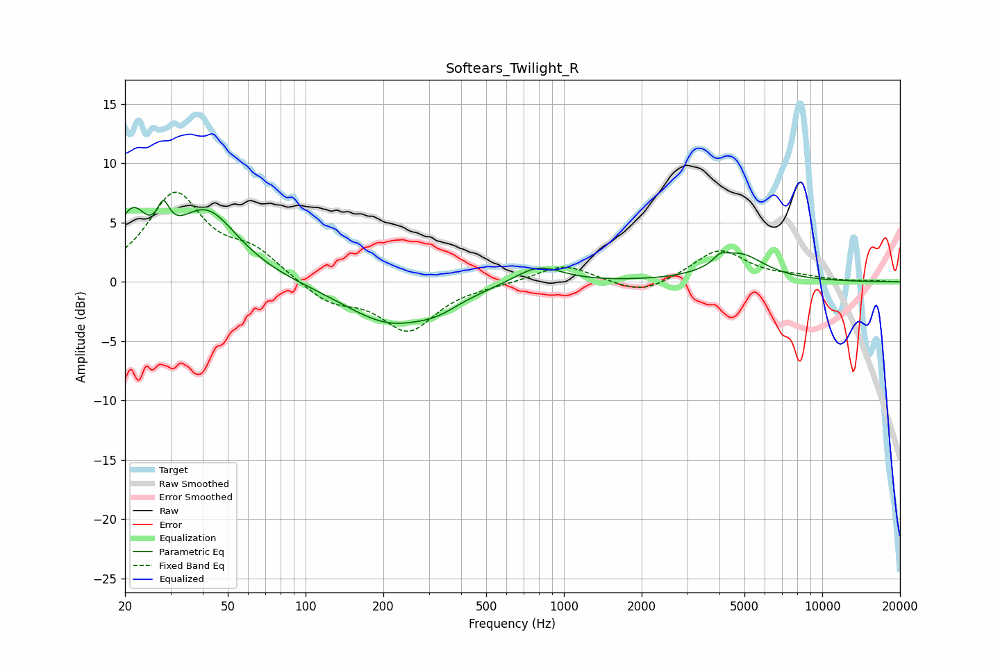

# Softears_Twilight_R
See [usage instructions](https://github.com/jaakkopasanen/AutoEq#usage) for more options and info.

### Parametric EQs
Apply preamp of -7.0 dB when using parametric equalizer.

|   # | Type    |   Fc (Hz) |    Q |   Gain (dB) |
|-----|---------|-----------|------|-------------|
|   1 | Peaking |        20 | 2.75 |         2.2 |
|   2 | Peaking |        22 | 3.02 |         2.6 |
|   3 | Peaking |        28 | 6    |         2.5 |
|   4 | Peaking |        41 | 1.14 |         5.9 |
|   5 | Peaking |       212 | 0.8  |        -3.5 |
|   6 | Peaking |       303 | 5.89 |        -0   |
|   7 | Peaking |       327 | 1.66 |        -0.8 |
|   8 | Peaking |       795 | 1.55 |         1.6 |
|   9 | Peaking |      4023 | 5.97 |         0.6 |
|  10 | Peaking |      4752 | 1.43 |         2.3 |

### Fixed Band EQs
When using fixed band (also called graphic) equalizer, apply preamp of **-7.7 dB** (if available) and set gains manually with these parameters.

|   # | Type    |   Fc (Hz) |    Q |   Gain (dB) |
|-----|---------|-----------|------|-------------|
|   1 | Peaking |        31 | 1.41 |         7.2 |
|   2 | Peaking |        62 | 1.41 |         2.2 |
|   3 | Peaking |       125 | 1.41 |        -1.7 |
|   4 | Peaking |       250 | 1.41 |        -4   |
|   5 | Peaking |       500 | 1.41 |        -0.2 |
|   6 | Peaking |      1000 | 1.41 |         1.5 |
|   7 | Peaking |      2000 | 1.41 |        -1.2 |
|   8 | Peaking |      4000 | 1.41 |         2.7 |
|   9 | Peaking |      8000 | 1.41 |         0.3 |
|  10 | Peaking |     16000 | 1.41 |         0.1 |

### Graphs

