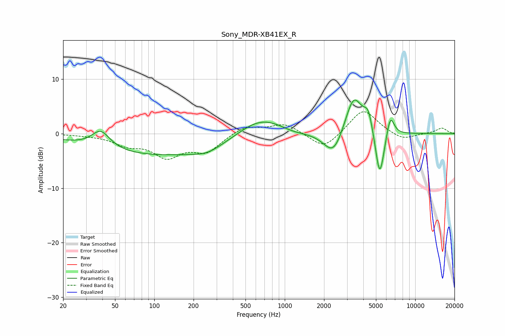

# Sony_MDR-XB41EX_R
See [usage instructions](https://github.com/jaakkopasanen/AutoEq#usage) for more options and info.

### Parametric EQs
Apply preamp of -6.3 dB when using parametric equalizer.

|   # | Type    |   Fc (Hz) |    Q |   Gain (dB) |
|-----|---------|-----------|------|-------------|
|   1 | Peaking |        39 | 2.03 |         3.2 |
|   2 | Peaking |       143 | 0.2  |        -4.2 |
|   3 | Peaking |       254 | 1.46 |        -0.9 |
|   4 | Peaking |       651 | 0.7  |         4.8 |
|   5 | Peaking |      1155 | 1.23 |        -0.8 |
|   6 | Peaking |      2370 | 1.86 |        -4.9 |
|   7 | Peaking |      3373 | 2.06 |         7.6 |
|   8 | Peaking |      4380 | 4    |         3.7 |
|   9 | Peaking |      5347 | 3.85 |        -9.5 |
|  10 | Peaking |      6439 | 4.54 |         4.2 |

### Fixed Band EQs
When using fixed band (also called graphic) equalizer, apply preamp of **-4.1 dB** (if available) and set gains manually with these parameters.

|   # | Type    |   Fc (Hz) |    Q |   Gain (dB) |
|-----|---------|-----------|------|-------------|
|   1 | Peaking |        31 | 1.41 |        -0.2 |
|   2 | Peaking |        62 | 1.41 |        -1.8 |
|   3 | Peaking |       125 | 1.41 |        -3.9 |
|   4 | Peaking |       250 | 1.41 |        -3.1 |
|   5 | Peaking |       500 | 1.41 |         1.5 |
|   6 | Peaking |      1000 | 1.41 |         1.9 |
|   7 | Peaking |      2000 | 1.41 |        -3   |
|   8 | Peaking |      4000 | 1.41 |         4.6 |
|   9 | Peaking |      8000 | 1.41 |        -1.3 |
|  10 | Peaking |     16000 | 1.41 |         1   |

### Graphs

