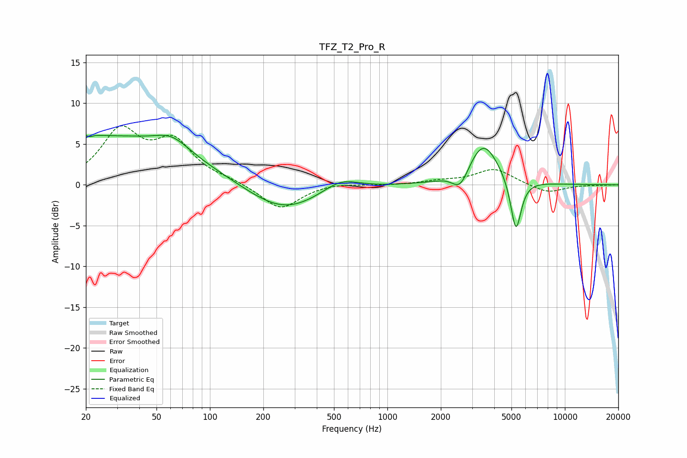

# TFZ_T2_Pro_R
See [usage instructions](https://github.com/jaakkopasanen/AutoEq#usage) for more options and info.

### Parametric EQs
Apply preamp of -6.2 dB when using parametric equalizer.

|   # | Type    |   Fc (Hz) |    Q |   Gain (dB) |
|-----|---------|-----------|------|-------------|
|   1 | Peaking |        21 | 4.9  |         1.9 |
|   2 | Peaking |        21 | 5.99 |        -1.8 |
|   3 | Peaking |        26 | 0.28 |         5.8 |
|   4 | Peaking |        61 | 1.48 |         1.7 |
|   5 | Peaking |       258 | 0.69 |        -3.5 |
|   6 | Peaking |       544 | 1.39 |         1.6 |
|   7 | Peaking |      2115 | 5.72 |         0.1 |
|   8 | Peaking |      2578 | 3.13 |        -2.3 |
|   9 | Peaking |      3470 | 1.62 |         5.3 |
|  10 | Peaking |      5299 | 4.64 |        -6.7 |

### Fixed Band EQs
When using fixed band (also called graphic) equalizer, apply preamp of **-7.3 dB** (if available) and set gains manually with these parameters.

|   # | Type    |   Fc (Hz) |    Q |   Gain (dB) |
|-----|---------|-----------|------|-------------|
|   1 | Peaking |        31 | 1.41 |         6.3 |
|   2 | Peaking |        62 | 1.41 |         4.8 |
|   3 | Peaking |       125 | 1.41 |         0.4 |
|   4 | Peaking |       250 | 1.41 |        -3.1 |
|   5 | Peaking |       500 | 1.41 |         0.3 |
|   6 | Peaking |      1000 | 1.41 |        -0.1 |
|   7 | Peaking |      2000 | 1.41 |         0.4 |
|   8 | Peaking |      4000 | 1.41 |         1.9 |
|   9 | Peaking |      8000 | 1.41 |        -1   |
|  10 | Peaking |     16000 | 1.41 |        -0   |

### Graphs

