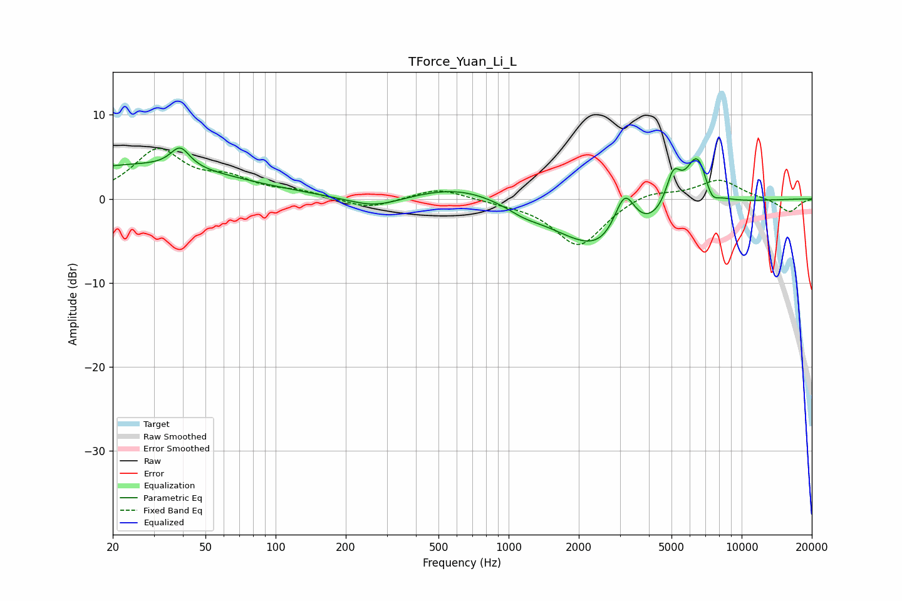

# TForce_Yuan_Li_L
See [usage instructions](https://github.com/jaakkopasanen/AutoEq#usage) for more options and info.

### Parametric EQs
Apply preamp of -6.1 dB when using parametric equalizer.

|   # | Type    |   Fc (Hz) |    Q |   Gain (dB) |
|-----|---------|-----------|------|-------------|
|   1 | Peaking |        25 | 0.33 |         3.9 |
|   2 | Peaking |        39 | 3.51 |         2.4 |
|   3 | Peaking |       265 | 1.2  |        -1.4 |
|   4 | Peaking |       623 | 0.75 |         1.8 |
|   5 | Peaking |      1161 | 2.01 |        -0.7 |
|   6 | Peaking |      2681 | 0.68 |        -7.1 |
|   7 | Peaking |      3145 | 2.87 |         6.1 |
|   8 | Peaking |      5092 | 4.24 |         4.2 |
|   9 | Peaking |      6456 | 2.64 |         6.7 |
|  10 | Peaking |      7399 | 4.43 |        -2   |

### Fixed Band EQs
When using fixed band (also called graphic) equalizer, apply preamp of **-6.1 dB** (if available) and set gains manually with these parameters.

|   # | Type    |   Fc (Hz) |    Q |   Gain (dB) |
|-----|---------|-----------|------|-------------|
|   1 | Peaking |        31 | 1.41 |         5.6 |
|   2 | Peaking |        62 | 1.41 |         1.9 |
|   3 | Peaking |       125 | 1.41 |         0.7 |
|   4 | Peaking |       250 | 1.41 |        -1.2 |
|   5 | Peaking |       500 | 1.41 |         1.3 |
|   6 | Peaking |      1000 | 1.41 |        -0.3 |
|   7 | Peaking |      2000 | 1.41 |        -5.7 |
|   8 | Peaking |      4000 | 1.41 |         1.1 |
|   9 | Peaking |      8000 | 1.41 |         2.3 |
|  10 | Peaking |     16000 | 1.41 |        -1.6 |

### Graphs

