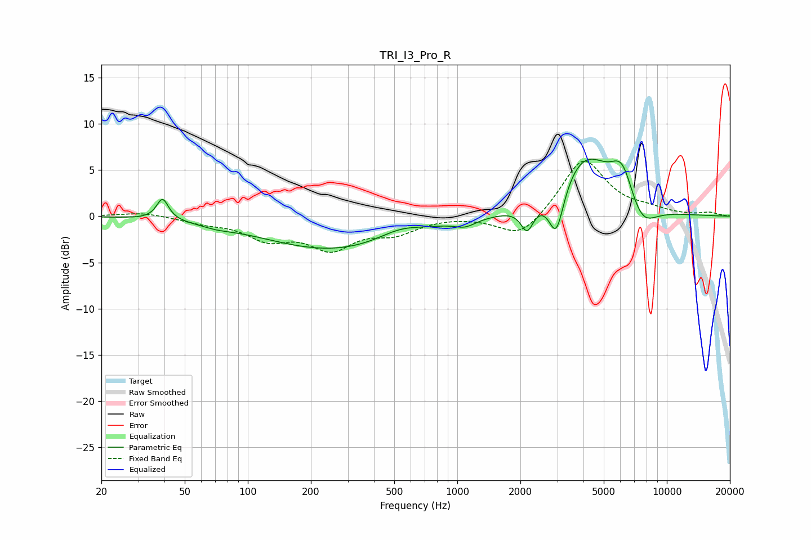

# TRI_I3_Pro_R
See [usage instructions](https://github.com/jaakkopasanen/AutoEq#usage) for more options and info.

### Parametric EQs
Apply preamp of -6.3 dB when using parametric equalizer.

|   # | Type    |   Fc (Hz) |    Q |   Gain (dB) |
|-----|---------|-----------|------|-------------|
|   1 | Peaking |        39 | 5.11 |         2.3 |
|   2 | Peaking |        71 | 1.92 |        -0.3 |
|   3 | Peaking |       259 | 0.42 |        -3.6 |
|   4 | Peaking |       531 | 1.35 |         1   |
|   5 | Peaking |      1093 | 2.87 |        -0.7 |
|   6 | Peaking |      2153 | 4.74 |        -2.6 |
|   7 | Peaking |      2968 | 3.92 |        -5.2 |
|   8 | Peaking |      4057 | 1.08 |         6.5 |
|   9 | Peaking |      6132 | 2.52 |         4.1 |
|  10 | Peaking |      7535 | 1.9  |        -3   |

### Fixed Band EQs
When using fixed band (also called graphic) equalizer, apply preamp of **-6.1 dB** (if available) and set gains manually with these parameters.

|   # | Type    |   Fc (Hz) |    Q |   Gain (dB) |
|-----|---------|-----------|------|-------------|
|   1 | Peaking |        31 | 1.41 |         0.5 |
|   2 | Peaking |        62 | 1.41 |        -0.6 |
|   3 | Peaking |       125 | 1.41 |        -2.2 |
|   4 | Peaking |       250 | 1.41 |        -3.2 |
|   5 | Peaking |       500 | 1.41 |        -1.6 |
|   6 | Peaking |      1000 | 1.41 |         0.1 |
|   7 | Peaking |      2000 | 1.41 |        -2.5 |
|   8 | Peaking |      4000 | 1.41 |         6.3 |
|   9 | Peaking |      8000 | 1.41 |         0.6 |
|  10 | Peaking |     16000 | 1.41 |         0.4 |

### Graphs

