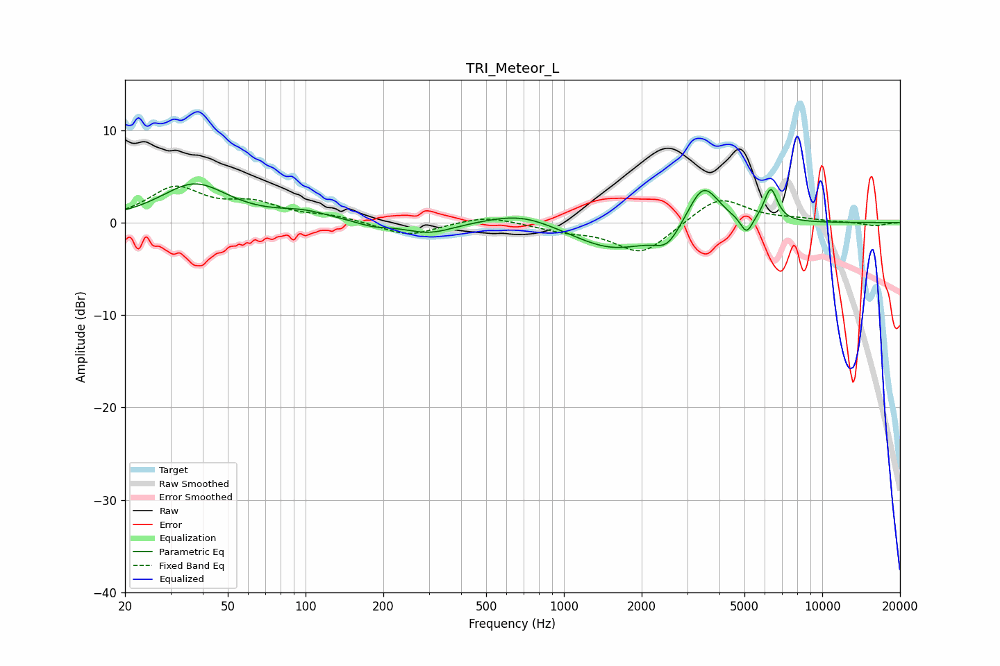

# TRI_Meteor_L
See [usage instructions](https://github.com/jaakkopasanen/AutoEq#usage) for more options and info.

### Parametric EQs
Apply preamp of -4.3 dB when using parametric equalizer.

|   # | Type    |   Fc (Hz) |    Q |   Gain (dB) |
|-----|---------|-----------|------|-------------|
|   1 | Peaking |        37 | 1.08 |         4.1 |
|   2 | Peaking |        98 | 1.36 |         0.9 |
|   3 | Peaking |       182 | 2.32 |        -0.5 |
|   4 | Peaking |       300 | 1.45 |        -1.2 |
|   5 | Peaking |       684 | 1.06 |         1.4 |
|   6 | Peaking |      1554 | 0.88 |        -3   |
|   7 | Peaking |      2517 | 2.77 |        -2   |
|   8 | Peaking |      3461 | 2.32 |         4.7 |
|   9 | Peaking |      5093 | 6    |        -1.9 |
|  10 | Peaking |      6318 | 5.28 |         3.6 |

### Fixed Band EQs
When using fixed band (also called graphic) equalizer, apply preamp of **-4.0 dB** (if available) and set gains manually with these parameters.

|   # | Type    |   Fc (Hz) |    Q |   Gain (dB) |
|-----|---------|-----------|------|-------------|
|   1 | Peaking |        31 | 1.41 |         3.6 |
|   2 | Peaking |        62 | 1.41 |         1.8 |
|   3 | Peaking |       125 | 1.41 |         0.6 |
|   4 | Peaking |       250 | 1.41 |        -1.5 |
|   5 | Peaking |       500 | 1.41 |         0.8 |
|   6 | Peaking |      1000 | 1.41 |        -0.7 |
|   7 | Peaking |      2000 | 1.41 |        -3.4 |
|   8 | Peaking |      4000 | 1.41 |         2.9 |
|   9 | Peaking |      8000 | 1.41 |         0.3 |
|  10 | Peaking |     16000 | 1.41 |        -0.4 |

### Graphs

