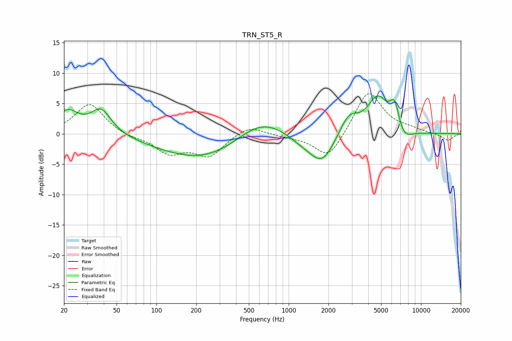

# TRN_ST5_R
See [usage instructions](https://github.com/jaakkopasanen/AutoEq#usage) for more options and info.

### Parametric EQs
Apply preamp of -6.3 dB when using parametric equalizer.

|   # | Type    |   Fc (Hz) |    Q |   Gain (dB) |
|-----|---------|-----------|------|-------------|
|   1 | Peaking |        21 | 1.69 |         3.5 |
|   2 | Peaking |        38 | 1.84 |         4   |
|   3 | Peaking |       294 | 0.35 |        -5.4 |
|   4 | Peaking |       604 | 0.64 |         5.7 |
|   5 | Peaking |      1278 | 1.21 |        -1.4 |
|   6 | Peaking |      1796 | 1.5  |        -4.7 |
|   7 | Peaking |      2849 | 2    |         3.3 |
|   8 | Peaking |      4709 | 1.78 |         5.8 |
|   9 | Peaking |      6332 | 3.66 |         4.5 |
|  10 | Peaking |      7280 | 2.12 |        -2.4 |

### Fixed Band EQs
When using fixed band (also called graphic) equalizer, apply preamp of **-6.7 dB** (if available) and set gains manually with these parameters.

|   # | Type    |   Fc (Hz) |    Q |   Gain (dB) |
|-----|---------|-----------|------|-------------|
|   1 | Peaking |        31 | 1.41 |         5   |
|   2 | Peaking |        62 | 1.41 |        -0.6 |
|   3 | Peaking |       125 | 1.41 |        -3   |
|   4 | Peaking |       250 | 1.41 |        -3.5 |
|   5 | Peaking |       500 | 1.41 |         1.6 |
|   6 | Peaking |      1000 | 1.41 |        -0.4 |
|   7 | Peaking |      2000 | 1.41 |        -4.3 |
|   8 | Peaking |      4000 | 1.41 |         7.3 |
|   9 | Peaking |      8000 | 1.41 |         0.6 |
|  10 | Peaking |     16000 | 1.41 |        -1.2 |

### Graphs

