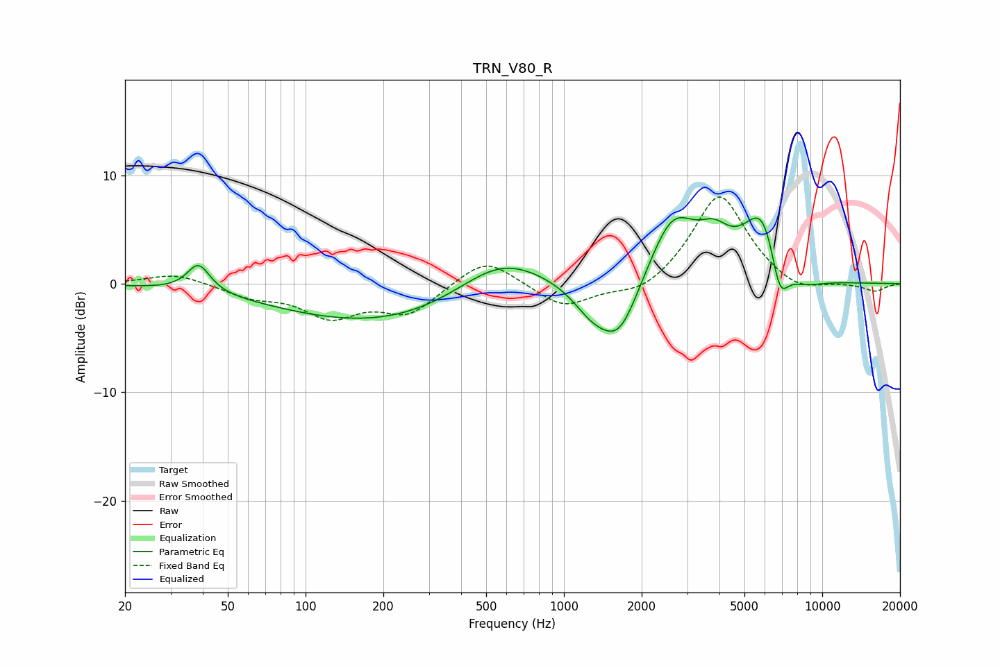

# TRN_V80_R
See [usage instructions](https://github.com/jaakkopasanen/AutoEq#usage) for more options and info.

### Parametric EQs
Apply preamp of -6.2 dB when using parametric equalizer.

|   # | Type    |   Fc (Hz) |    Q |   Gain (dB) |
|-----|---------|-----------|------|-------------|
|   1 | Peaking |        39 | 3.25 |         2.6 |
|   2 | Peaking |       209 | 0.34 |        -3.8 |
|   3 | Peaking |       570 | 0.79 |         4   |
|   4 | Peaking |      1280 | 1.89 |        -2.1 |
|   5 | Peaking |      1637 | 1.74 |        -5.5 |
|   6 | Peaking |      2638 | 1.48 |         6.3 |
|   7 | Peaking |      3815 | 2.38 |         2.3 |
|   8 | Peaking |      5943 | 1.75 |         7.2 |
|   9 | Peaking |      6826 | 3.68 |        -4.8 |
|  10 | Peaking |      8087 | 1.46 |        -1.6 |

### Fixed Band EQs
When using fixed band (also called graphic) equalizer, apply preamp of **-8.1 dB** (if available) and set gains manually with these parameters.

|   # | Type    |   Fc (Hz) |    Q |   Gain (dB) |
|-----|---------|-----------|------|-------------|
|   1 | Peaking |        31 | 1.41 |         1   |
|   2 | Peaking |        62 | 1.41 |        -1.1 |
|   3 | Peaking |       125 | 1.41 |        -2.8 |
|   4 | Peaking |       250 | 1.41 |        -2.6 |
|   5 | Peaking |       500 | 1.41 |         2.6 |
|   6 | Peaking |      1000 | 1.41 |        -2.3 |
|   7 | Peaking |      2000 | 1.41 |        -1.3 |
|   8 | Peaking |      4000 | 1.41 |         8.4 |
|   9 | Peaking |      8000 | 1.41 |        -1.1 |
|  10 | Peaking |     16000 | 1.41 |        -0.7 |

### Graphs

