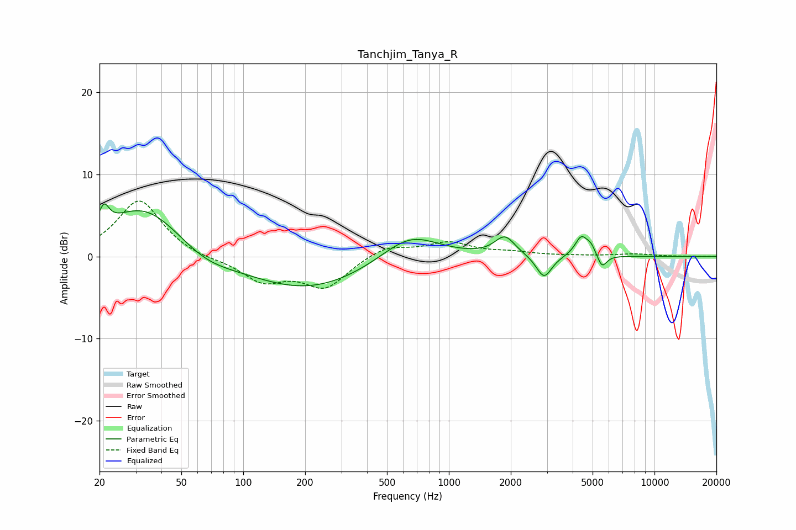

# Tanchjim_Tanya_R
See [usage instructions](https://github.com/jaakkopasanen/AutoEq#usage) for more options and info.

### Parametric EQs
Apply preamp of -6.5 dB when using parametric equalizer.

|   # | Type    |   Fc (Hz) |    Q |   Gain (dB) |
|-----|---------|-----------|------|-------------|
|   1 | Peaking |        21 | 5.77 |         2.5 |
|   2 | Peaking |        33 | 0.75 |         6.3 |
|   3 | Peaking |        65 | 1.06 |        -1.6 |
|   4 | Peaking |       204 | 0.48 |        -4.1 |
|   5 | Peaking |       646 | 1    |         3.4 |
|   6 | Peaking |      1873 | 2.9  |         2.3 |
|   7 | Peaking |      2902 | 3.76 |        -2.8 |
|   8 | Peaking |      4408 | 4.53 |         2.4 |
|   9 | Peaking |      4922 | 5.97 |         1   |
|  10 | Peaking |      5553 | 6    |        -1.6 |

### Fixed Band EQs
When using fixed band (also called graphic) equalizer, apply preamp of **-6.8 dB** (if available) and set gains manually with these parameters.

|   # | Type    |   Fc (Hz) |    Q |   Gain (dB) |
|-----|---------|-----------|------|-------------|
|   1 | Peaking |        31 | 1.41 |         6.9 |
|   2 | Peaking |        62 | 1.41 |        -0.4 |
|   3 | Peaking |       125 | 1.41 |        -2.9 |
|   4 | Peaking |       250 | 1.41 |        -3.7 |
|   5 | Peaking |       500 | 1.41 |         1.4 |
|   6 | Peaking |      1000 | 1.41 |         1.6 |
|   7 | Peaking |      2000 | 1.41 |         0.4 |
|   8 | Peaking |      4000 | 1.41 |         0.1 |
|   9 | Peaking |      8000 | 1.41 |         0.3 |
|  10 | Peaking |     16000 | 1.41 |        -0   |

### Graphs

