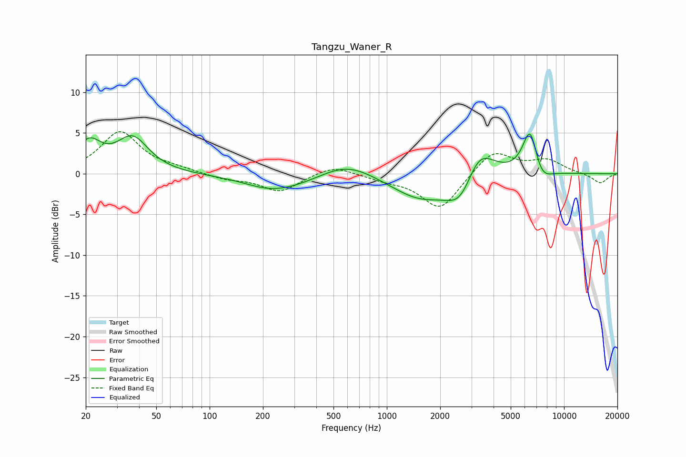

# Tangzu_Waner_R
See [usage instructions](https://github.com/jaakkopasanen/AutoEq#usage) for more options and info.

### Parametric EQs
Apply preamp of -5.0 dB when using parametric equalizer.

|   # | Type    |   Fc (Hz) |    Q |   Gain (dB) |
|-----|---------|-----------|------|-------------|
|   1 | Peaking |        21 | 2.04 |         3.5 |
|   2 | Peaking |        37 | 1.58 |         4.2 |
|   3 | Peaking |       210 | 1.26 |        -0.5 |
|   4 | Peaking |       265 | 0.7  |        -1.8 |
|   5 | Peaking |       594 | 0.91 |         2   |
|   6 | Peaking |      1545 | 0.83 |        -3.1 |
|   7 | Peaking |      2632 | 1.7  |        -4   |
|   8 | Peaking |      3275 | 1.62 |         4.7 |
|   9 | Peaking |      6440 | 3.16 |         5.9 |
|  10 | Peaking |      7369 | 2.52 |        -2.1 |

### Fixed Band EQs
When using fixed band (also called graphic) equalizer, apply preamp of **-5.3 dB** (if available) and set gains manually with these parameters.

|   # | Type    |   Fc (Hz) |    Q |   Gain (dB) |
|-----|---------|-----------|------|-------------|
|   1 | Peaking |        31 | 1.41 |         5.1 |
|   2 | Peaking |        62 | 1.41 |         0.5 |
|   3 | Peaking |       125 | 1.41 |        -0.6 |
|   4 | Peaking |       250 | 1.41 |        -2.2 |
|   5 | Peaking |       500 | 1.41 |         1.1 |
|   6 | Peaking |      1000 | 1.41 |        -0.6 |
|   7 | Peaking |      2000 | 1.41 |        -4.4 |
|   8 | Peaking |      4000 | 1.41 |         3   |
|   9 | Peaking |      8000 | 1.41 |         1.6 |
|  10 | Peaking |     16000 | 1.41 |        -1.2 |

### Graphs

