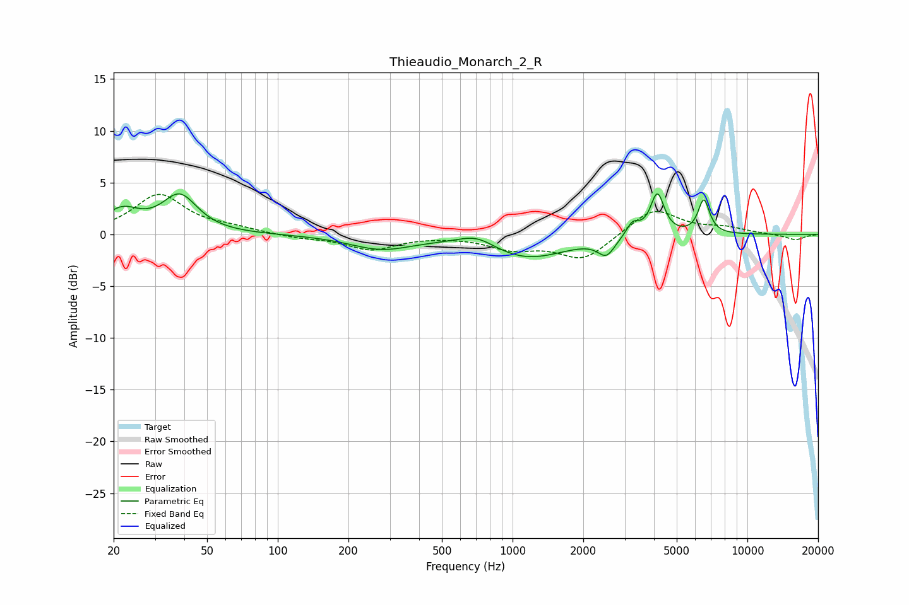

# Thieaudio_Monarch_2_R
See [usage instructions](https://github.com/jaakkopasanen/AutoEq#usage) for more options and info.

### Parametric EQs
Apply preamp of -4.0 dB when using parametric equalizer.

|   # | Type    |   Fc (Hz) |    Q |   Gain (dB) |
|-----|---------|-----------|------|-------------|
|   1 | Peaking |        22 | 1.89 |         2.1 |
|   2 | Peaking |        38 | 1.92 |         3.6 |
|   3 | Peaking |       276 | 1.05 |        -1.3 |
|   4 | Peaking |       703 | 1.76 |         1.1 |
|   5 | Peaking |      1146 | 0.82 |        -2.3 |
|   6 | Peaking |      2509 | 3.96 |        -1.6 |
|   7 | Peaking |      3278 | 5.14 |         2.1 |
|   8 | Peaking |      3321 | 5.99 |        -0.8 |
|   9 | Peaking |      4135 | 4.86 |         4   |
|  10 | Peaking |      6525 | 5.72 |         3.3 |

### Fixed Band EQs
When using fixed band (also called graphic) equalizer, apply preamp of **-4.0 dB** (if available) and set gains manually with these parameters.

|   # | Type    |   Fc (Hz) |    Q |   Gain (dB) |
|-----|---------|-----------|------|-------------|
|   1 | Peaking |        31 | 1.41 |         3.8 |
|   2 | Peaking |        62 | 1.41 |         0.5 |
|   3 | Peaking |       125 | 1.41 |        -0.3 |
|   4 | Peaking |       250 | 1.41 |        -1.4 |
|   5 | Peaking |       500 | 1.41 |        -0   |
|   6 | Peaking |      1000 | 1.41 |        -1.2 |
|   7 | Peaking |      2000 | 1.41 |        -2.4 |
|   8 | Peaking |      4000 | 1.41 |         2.6 |
|   9 | Peaking |      8000 | 1.41 |         0.6 |
|  10 | Peaking |     16000 | 1.41 |        -0.5 |

### Graphs

