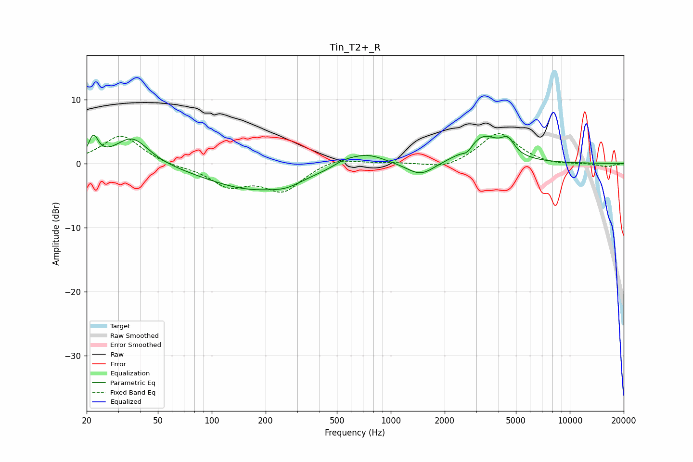

# Tin_T2+_R
See [usage instructions](https://github.com/jaakkopasanen/AutoEq#usage) for more options and info.

### Parametric EQs
Apply preamp of -4.5 dB when using parametric equalizer.

|   # | Type    |   Fc (Hz) |    Q |   Gain (dB) |
|-----|---------|-----------|------|-------------|
|   1 | Peaking |        22 | 5.4  |         3.4 |
|   2 | Peaking |        36 | 1.52 |         4.3 |
|   3 | Peaking |       170 | 0.54 |        -4   |
|   4 | Peaking |       261 | 1.82 |        -0.8 |
|   5 | Peaking |       548 | 2.38 |         0.7 |
|   6 | Peaking |       728 | 1.34 |         1.9 |
|   7 | Peaking |      1471 | 1.8  |        -2.2 |
|   8 | Peaking |      2681 | 5    |        -1   |
|   9 | Peaking |      3274 | 1.49 |         4.3 |
|  10 | Peaking |      4503 | 3.89 |         2.2 |

### Fixed Band EQs
When using fixed band (also called graphic) equalizer, apply preamp of **-4.7 dB** (if available) and set gains manually with these parameters.

|   # | Type    |   Fc (Hz) |    Q |   Gain (dB) |
|-----|---------|-----------|------|-------------|
|   1 | Peaking |        31 | 1.41 |         4.5 |
|   2 | Peaking |        62 | 1.41 |        -0.4 |
|   3 | Peaking |       125 | 1.41 |        -3.2 |
|   4 | Peaking |       250 | 1.41 |        -4.1 |
|   5 | Peaking |       500 | 1.41 |         1.1 |
|   6 | Peaking |      1000 | 1.41 |         0.1 |
|   7 | Peaking |      2000 | 1.41 |        -1   |
|   8 | Peaking |      4000 | 1.41 |         4.9 |
|   9 | Peaking |      8000 | 1.41 |        -0.3 |
|  10 | Peaking |     16000 | 1.41 |        -0.5 |

### Graphs

