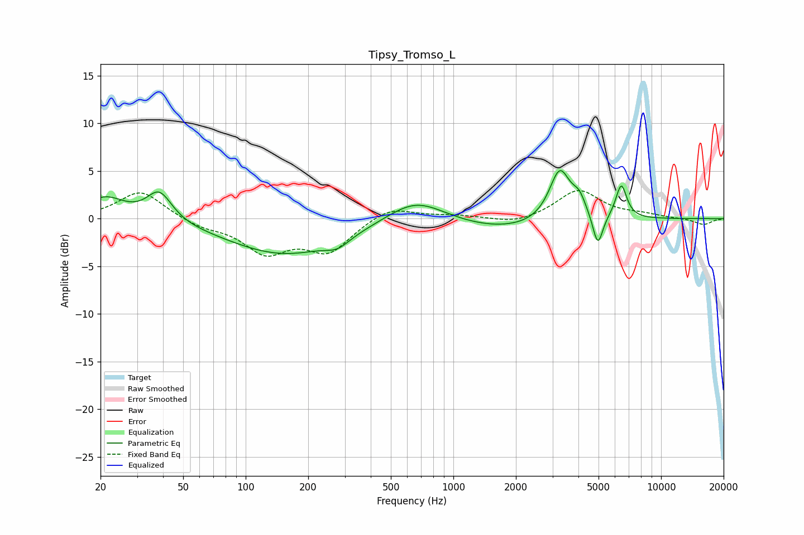

# Tipsy_Tromso_L
See [usage instructions](https://github.com/jaakkopasanen/AutoEq#usage) for more options and info.

### Parametric EQs
Apply preamp of -5.1 dB when using parametric equalizer.

|   # | Type    |   Fc (Hz) |    Q |   Gain (dB) |
|-----|---------|-----------|------|-------------|
|   1 | Peaking |        21 | 1.5  |         2.2 |
|   2 | Peaking |        38 | 2.35 |         3.1 |
|   3 | Peaking |       154 | 0.51 |        -3.7 |
|   4 | Peaking |       277 | 2.51 |        -0.9 |
|   5 | Peaking |       657 | 1.01 |         2.6 |
|   6 | Peaking |      1740 | 0.58 |        -1.2 |
|   7 | Peaking |      3252 | 2.79 |         5.4 |
|   8 | Peaking |      4036 | 4.19 |         1.7 |
|   9 | Peaking |      4960 | 5.74 |        -3.4 |
|  10 | Peaking |      6432 | 5.15 |         3.6 |

### Fixed Band EQs
When using fixed band (also called graphic) equalizer, apply preamp of **-3.0 dB** (if available) and set gains manually with these parameters.

|   # | Type    |   Fc (Hz) |    Q |   Gain (dB) |
|-----|---------|-----------|------|-------------|
|   1 | Peaking |        31 | 1.41 |         3   |
|   2 | Peaking |        62 | 1.41 |        -0.8 |
|   3 | Peaking |       125 | 1.41 |        -3.3 |
|   4 | Peaking |       250 | 1.41 |        -3.3 |
|   5 | Peaking |       500 | 1.41 |         1.4 |
|   6 | Peaking |      1000 | 1.41 |         0.3 |
|   7 | Peaking |      2000 | 1.41 |        -0.6 |
|   8 | Peaking |      4000 | 1.41 |         3   |
|   9 | Peaking |      8000 | 1.41 |         0.4 |
|  10 | Peaking |     16000 | 1.41 |        -0.6 |

### Graphs

