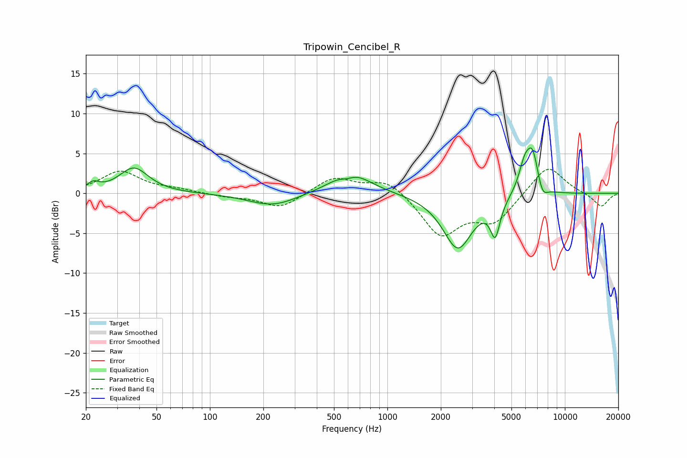

# Tripowin_Cencibel_R
See [usage instructions](https://github.com/jaakkopasanen/AutoEq#usage) for more options and info.

### Parametric EQs
Apply preamp of -5.8 dB when using parametric equalizer.

|   # | Type    |   Fc (Hz) |    Q |   Gain (dB) |
|-----|---------|-----------|------|-------------|
|   1 | Peaking |        22 | 4.29 |         0.9 |
|   2 | Peaking |        37 | 1.73 |         3.2 |
|   3 | Peaking |       226 | 1.04 |        -1.6 |
|   4 | Peaking |       594 | 3.33 |        -0.7 |
|   5 | Peaking |       614 | 1.29 |         3   |
|   6 | Peaking |      2493 | 1.68 |        -6.9 |
|   7 | Peaking |      4052 | 5.18 |        -4.3 |
|   8 | Peaking |      5945 | 3.93 |         3.5 |
|   9 | Peaking |      6590 | 4.24 |         4.5 |
|  10 | Peaking |      7482 | 5    |        -1.5 |

### Fixed Band EQs
When using fixed band (also called graphic) equalizer, apply preamp of **-3.1 dB** (if available) and set gains manually with these parameters.

|   # | Type    |   Fc (Hz) |    Q |   Gain (dB) |
|-----|---------|-----------|------|-------------|
|   1 | Peaking |        31 | 1.41 |         2.7 |
|   2 | Peaking |        62 | 1.41 |         0.4 |
|   3 | Peaking |       125 | 1.41 |        -0.4 |
|   4 | Peaking |       250 | 1.41 |        -1.9 |
|   5 | Peaking |       500 | 1.41 |         2.1 |
|   6 | Peaking |      1000 | 1.41 |         1.9 |
|   7 | Peaking |      2000 | 1.41 |        -5.2 |
|   8 | Peaking |      4000 | 1.41 |        -3.4 |
|   9 | Peaking |      8000 | 1.41 |         3.7 |
|  10 | Peaking |     16000 | 1.41 |        -1.7 |

### Graphs

