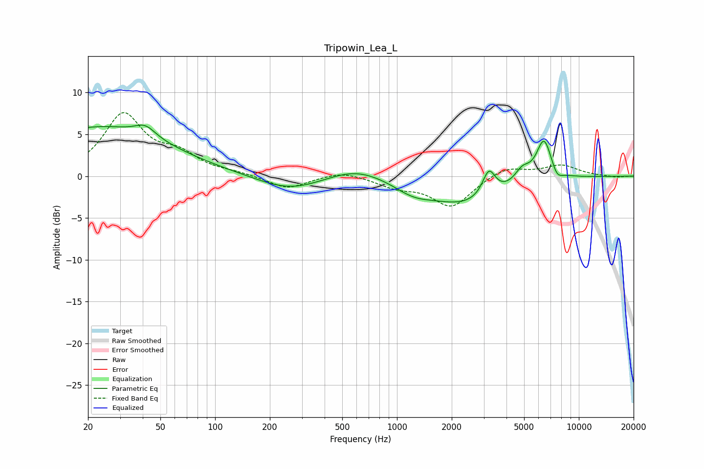

# Tripowin_Lea_L
See [usage instructions](https://github.com/jaakkopasanen/AutoEq#usage) for more options and info.

### Parametric EQs
Apply preamp of -6.2 dB when using parametric equalizer.

|   # | Type    |   Fc (Hz) |    Q |   Gain (dB) |
|-----|---------|-----------|------|-------------|
|   1 | Peaking |        23 | 0.36 |         5.8 |
|   2 | Peaking |        41 | 2.54 |         1.3 |
|   3 | Peaking |       258 | 0.79 |        -1.8 |
|   4 | Peaking |       597 | 0.9  |         1.4 |
|   5 | Peaking |      1222 | 1.4  |        -1.2 |
|   6 | Peaking |      2389 | 0.65 |        -3.3 |
|   7 | Peaking |      3202 | 4    |         3.2 |
|   8 | Peaking |      4883 | 3.32 |         1.6 |
|   9 | Peaking |      6430 | 3.19 |         5   |
|  10 | Peaking |      7585 | 4.61 |        -1.1 |

### Fixed Band EQs
When using fixed band (also called graphic) equalizer, apply preamp of **-7.7 dB** (if available) and set gains manually with these parameters.

|   # | Type    |   Fc (Hz) |    Q |   Gain (dB) |
|-----|---------|-----------|------|-------------|
|   1 | Peaking |        31 | 1.41 |         7.2 |
|   2 | Peaking |        62 | 1.41 |         2.2 |
|   3 | Peaking |       125 | 1.41 |         0.3 |
|   4 | Peaking |       250 | 1.41 |        -1.5 |
|   5 | Peaking |       500 | 1.41 |         0.7 |
|   6 | Peaking |      1000 | 1.41 |        -1.1 |
|   7 | Peaking |      2000 | 1.41 |        -3.6 |
|   8 | Peaking |      4000 | 1.41 |         1.2 |
|   9 | Peaking |      8000 | 1.41 |         1.3 |
|  10 | Peaking |     16000 | 1.41 |        -0.2 |

### Graphs

