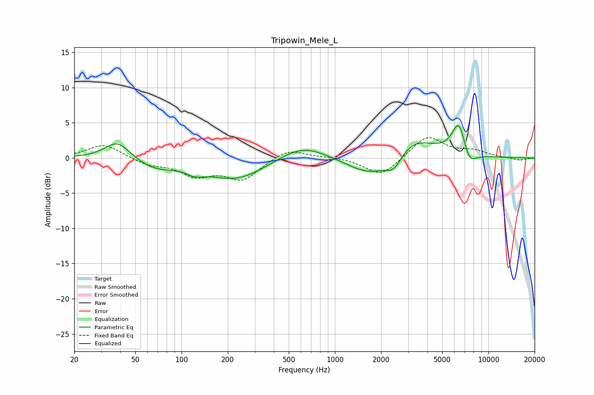

# Tripowin_Mele_L
See [usage instructions](https://github.com/jaakkopasanen/AutoEq#usage) for more options and info.

### Parametric EQs
Apply preamp of -4.7 dB when using parametric equalizer.

|   # | Type    |   Fc (Hz) |    Q |   Gain (dB) |
|-----|---------|-----------|------|-------------|
|   1 | Peaking |        38 | 1.7  |         2.6 |
|   2 | Peaking |        67 | 1.12 |        -1.4 |
|   3 | Peaking |       123 | 2.48 |        -0.8 |
|   4 | Peaking |       227 | 0.73 |        -3.1 |
|   5 | Peaking |       614 | 0.91 |         2.2 |
|   6 | Peaking |      1727 | 0.95 |        -2.9 |
|   7 | Peaking |      2427 | 2.62 |        -2.1 |
|   8 | Peaking |      3191 | 0.97 |         3.2 |
|   9 | Peaking |      6431 | 2.99 |         5   |
|  10 | Peaking |      7461 | 2.87 |        -2.4 |

### Fixed Band EQs
When using fixed band (also called graphic) equalizer, apply preamp of **-3.0 dB** (if available) and set gains manually with these parameters.

|   # | Type    |   Fc (Hz) |    Q |   Gain (dB) |
|-----|---------|-----------|------|-------------|
|   1 | Peaking |        31 | 1.41 |         2   |
|   2 | Peaking |        62 | 1.41 |        -0.9 |
|   3 | Peaking |       125 | 1.41 |        -2.3 |
|   4 | Peaking |       250 | 1.41 |        -2.9 |
|   5 | Peaking |       500 | 1.41 |         1.4 |
|   6 | Peaking |      1000 | 1.41 |         0.2 |
|   7 | Peaking |      2000 | 1.41 |        -2.6 |
|   8 | Peaking |      4000 | 1.41 |         3.2 |
|   9 | Peaking |      8000 | 1.41 |         0.9 |
|  10 | Peaking |     16000 | 1.41 |        -0.4 |

### Graphs

