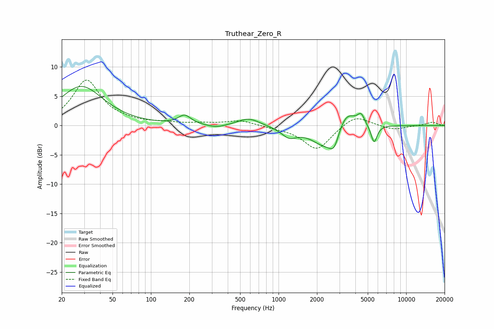

# Truthear_Zero_R
See [usage instructions](https://github.com/jaakkopasanen/AutoEq#usage) for more options and info.

### Parametric EQs
Apply preamp of -6.8 dB when using parametric equalizer.

|   # | Type    |   Fc (Hz) |    Q |   Gain (dB) |
|-----|---------|-----------|------|-------------|
|   1 | Peaking |        28 | 0.83 |         6.7 |
|   2 | Peaking |       184 | 2.9  |         1.6 |
|   3 | Peaking |       326 | 1.87 |        -0.5 |
|   4 | Peaking |       584 | 1.66 |         1.3 |
|   5 | Peaking |      1209 | 2.36 |        -1.6 |
|   6 | Peaking |      2354 | 1.29 |        -3.8 |
|   7 | Peaking |      2729 | 3.83 |        -2.5 |
|   8 | Peaking |      3374 | 1.87 |         3.7 |
|   9 | Peaking |      4433 | 5.24 |         1.7 |
|  10 | Peaking |      5603 | 5.79 |        -3.1 |

### Fixed Band EQs
When using fixed band (also called graphic) equalizer, apply preamp of **-7.8 dB** (if available) and set gains manually with these parameters.

|   # | Type    |   Fc (Hz) |    Q |   Gain (dB) |
|-----|---------|-----------|------|-------------|
|   1 | Peaking |        31 | 1.41 |         7.7 |
|   2 | Peaking |        62 | 1.41 |         0.4 |
|   3 | Peaking |       125 | 1.41 |         0.4 |
|   4 | Peaking |       250 | 1.41 |         0.3 |
|   5 | Peaking |       500 | 1.41 |         0.9 |
|   6 | Peaking |      1000 | 1.41 |        -0.3 |
|   7 | Peaking |      2000 | 1.41 |        -4.2 |
|   8 | Peaking |      4000 | 1.41 |         1.9 |
|   9 | Peaking |      8000 | 1.41 |        -0.7 |
|  10 | Peaking |     16000 | 1.41 |         0.6 |

### Graphs

