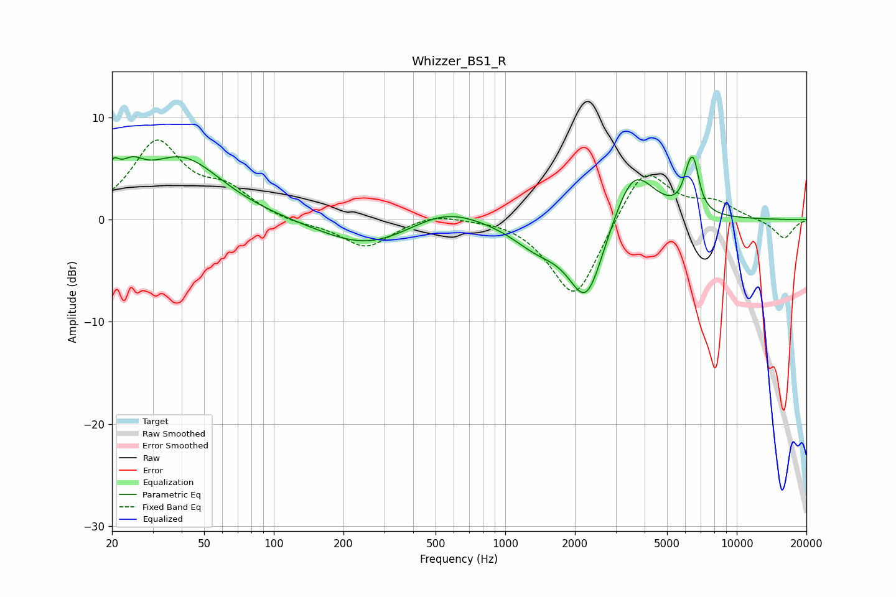

# Whizzer_BS1_R
See [usage instructions](https://github.com/jaakkopasanen/AutoEq#usage) for more options and info.

### Parametric EQs
Apply preamp of -6.3 dB when using parametric equalizer.

|   # | Type    |   Fc (Hz) |    Q |   Gain (dB) |
|-----|---------|-----------|------|-------------|
|   1 | Peaking |        20 | 5.27 |         2.4 |
|   2 | Peaking |        24 | 2.66 |         2.3 |
|   3 | Peaking |        40 | 0.81 |         6   |
|   4 | Peaking |       255 | 0.7  |        -2.8 |
|   5 | Peaking |       547 | 0.91 |         1.8 |
|   6 | Peaking |      1373 | 1.26 |        -2.2 |
|   7 | Peaking |      2244 | 1.77 |        -8.1 |
|   8 | Peaking |      3570 | 1.53 |         5.9 |
|   9 | Peaking |      6223 | 5.19 |         2.9 |
|  10 | Peaking |      6554 | 6    |         3.2 |

### Fixed Band EQs
When using fixed band (also called graphic) equalizer, apply preamp of **-7.9 dB** (if available) and set gains manually with these parameters.

|   # | Type    |   Fc (Hz) |    Q |   Gain (dB) |
|-----|---------|-----------|------|-------------|
|   1 | Peaking |        31 | 1.41 |         7.4 |
|   2 | Peaking |        62 | 1.41 |         2.5 |
|   3 | Peaking |       125 | 1.41 |        -0.4 |
|   4 | Peaking |       250 | 1.41 |        -2.7 |
|   5 | Peaking |       500 | 1.41 |         0.8 |
|   6 | Peaking |      1000 | 1.41 |         0.3 |
|   7 | Peaking |      2000 | 1.41 |        -8.1 |
|   8 | Peaking |      4000 | 1.41 |         5.5 |
|   9 | Peaking |      8000 | 1.41 |         1.5 |
|  10 | Peaking |     16000 | 1.41 |        -1.9 |

### Graphs

