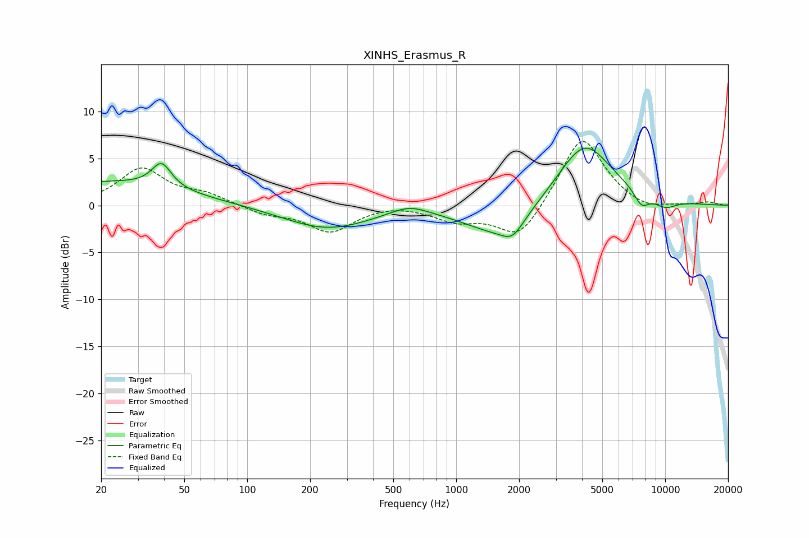

# XINHS_Erasmus_R
See [usage instructions](https://github.com/jaakkopasanen/AutoEq#usage) for more options and info.

### Parametric EQs
Apply preamp of -6.2 dB when using parametric equalizer.

|   # | Type    |   Fc (Hz) |    Q |   Gain (dB) |
|-----|---------|-----------|------|-------------|
|   1 | Peaking |        21 | 0.38 |         2.5 |
|   2 | Peaking |        39 | 3.08 |         2.6 |
|   3 | Peaking |       241 | 0.68 |        -2.5 |
|   4 | Peaking |       597 | 1.58 |         1   |
|   5 | Peaking |      1647 | 0.78 |        -4.2 |
|   6 | Peaking |      1863 | 2.77 |        -1.6 |
|   7 | Peaking |      2848 | 0.4  |         1.5 |
|   8 | Peaking |      4110 | 1.14 |         6   |
|   9 | Peaking |      7701 | 3.72 |        -1.6 |
|  10 | Peaking |     10000 | 2.21 |        -1   |

### Fixed Band EQs
When using fixed band (also called graphic) equalizer, apply preamp of **-6.9 dB** (if available) and set gains manually with these parameters.

|   # | Type    |   Fc (Hz) |    Q |   Gain (dB) |
|-----|---------|-----------|------|-------------|
|   1 | Peaking |        31 | 1.41 |         3.8 |
|   2 | Peaking |        62 | 1.41 |         1   |
|   3 | Peaking |       125 | 1.41 |        -0.9 |
|   4 | Peaking |       250 | 1.41 |        -2.7 |
|   5 | Peaking |       500 | 1.41 |         0.3 |
|   6 | Peaking |      1000 | 1.41 |        -1.5 |
|   7 | Peaking |      2000 | 1.41 |        -3.8 |
|   8 | Peaking |      4000 | 1.41 |         7.6 |
|   9 | Peaking |      8000 | 1.41 |        -0.7 |
|  10 | Peaking |     16000 | 1.41 |         0.3 |

### Graphs

