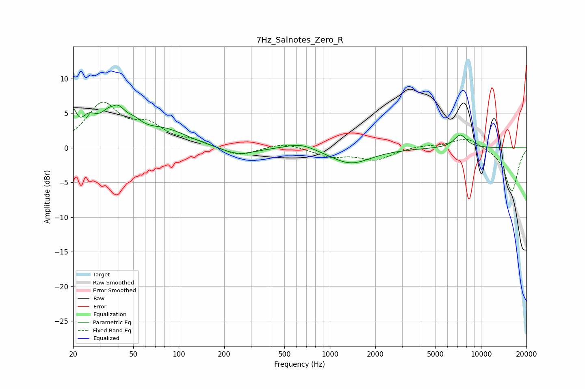

# 7Hz_Salnotes_Zero_R
See [usage instructions](https://github.com/jaakkopasanen/AutoEq#usage) for more options and info.

### Parametric EQs
Apply preamp of -6.3 dB when using parametric equalizer.

|   # | Type    |   Fc (Hz) |    Q |   Gain (dB) |
|-----|---------|-----------|------|-------------|
|   1 | Peaking |        20 | 6    |         3.7 |
|   2 | Peaking |        25 | 2.77 |         2.8 |
|   3 | Peaking |        37 | 4.25 |        -1.4 |
|   4 | Peaking |        37 | 2.11 |         6.1 |
|   5 | Peaking |        51 | 2.95 |         1   |
|   6 | Peaking |        81 | 0.91 |         2.4 |
|   7 | Peaking |       246 | 1.28 |        -1.2 |
|   8 | Peaking |       640 | 1.43 |         1   |
|   9 | Peaking |      1371 | 1.05 |        -2.3 |
|  10 | Peaking |      7297 | 3.18 |         1.9 |

### Fixed Band EQs
When using fixed band (also called graphic) equalizer, apply preamp of **-6.7 dB** (if available) and set gains manually with these parameters.

|   # | Type    |   Fc (Hz) |    Q |   Gain (dB) |
|-----|---------|-----------|------|-------------|
|   1 | Peaking |        31 | 1.41 |         6.1 |
|   2 | Peaking |        62 | 1.41 |         2.7 |
|   3 | Peaking |       125 | 1.41 |         0.8 |
|   4 | Peaking |       250 | 1.41 |        -1.3 |
|   5 | Peaking |       500 | 1.41 |         0.8 |
|   6 | Peaking |      1000 | 1.41 |        -1.2 |
|   7 | Peaking |      2000 | 1.41 |        -1.7 |
|   8 | Peaking |      4000 | 1.41 |         0.3 |
|   9 | Peaking |      8000 | 1.41 |         1.6 |
|  10 | Peaking |     16000 | 1.41 |        -6.3 |

### Graphs

