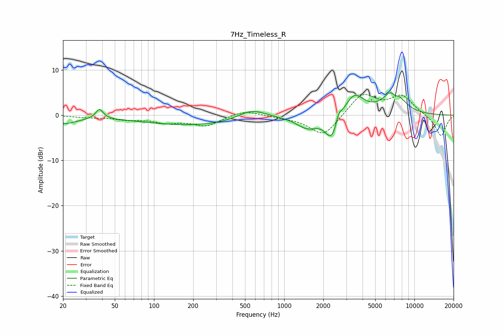

# 7Hz_Timeless_R
See [usage instructions](https://github.com/jaakkopasanen/AutoEq#usage) for more options and info.

### Parametric EQs
Apply preamp of -5.0 dB when using parametric equalizer.

|   # | Type    |   Fc (Hz) |    Q |   Gain (dB) |
|-----|---------|-----------|------|-------------|
|   1 | Peaking |        20 | 1.34 |        -1.7 |
|   2 | Peaking |        38 | 5.05 |         2.2 |
|   3 | Peaking |       217 | 0.32 |        -2.3 |
|   4 | Peaking |       562 | 1.25 |         2.5 |
|   5 | Peaking |      1509 | 1.75 |        -2.6 |
|   6 | Peaking |      2325 | 2.82 |        -5.8 |
|   7 | Peaking |      2618 | 6    |         2.1 |
|   8 | Peaking |      3440 | 1.88 |         4.8 |
|   9 | Peaking |      6942 | 1.89 |         5.9 |
|  10 | Peaking |      7111 | 4.83 |        -1.7 |

### Fixed Band EQs
When using fixed band (also called graphic) equalizer, apply preamp of **-4.7 dB** (if available) and set gains manually with these parameters.

|   # | Type    |   Fc (Hz) |    Q |   Gain (dB) |
|-----|---------|-----------|------|-------------|
|   1 | Peaking |        31 | 1.41 |        -0.4 |
|   2 | Peaking |        62 | 1.41 |        -0.8 |
|   3 | Peaking |       125 | 1.41 |        -1.4 |
|   4 | Peaking |       250 | 1.41 |        -2.2 |
|   5 | Peaking |       500 | 1.41 |         1.2 |
|   6 | Peaking |      1000 | 1.41 |        -0.3 |
|   7 | Peaking |      2000 | 1.41 |        -4.8 |
|   8 | Peaking |      4000 | 1.41 |         4.8 |
|   9 | Peaking |      8000 | 1.41 |         4.1 |
|  10 | Peaking |     16000 | 1.41 |        -4.7 |

### Graphs

