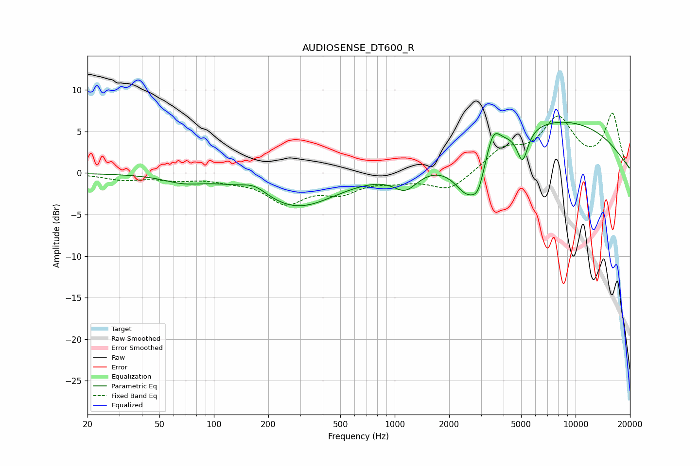

# AUDIOSENSE_DT600_R
See [usage instructions](https://github.com/jaakkopasanen/AutoEq#usage) for more options and info.

### Parametric EQs
Apply preamp of -6.2 dB when using parametric equalizer.

|   # | Type    |   Fc (Hz) |    Q |   Gain (dB) |
|-----|---------|-----------|------|-------------|
|   1 | Peaking |        68 | 1.32 |        -0.8 |
|   2 | Peaking |       168 | 2.03 |         1.1 |
|   3 | Peaking |       288 | 0.66 |        -4.1 |
|   4 | Peaking |       786 | 0.88 |        -0   |
|   5 | Peaking |      1146 | 2.11 |        -2.2 |
|   6 | Peaking |      2539 | 1.79 |        -5.2 |
|   7 | Peaking |      2904 | 4.22 |        -2.4 |
|   8 | Peaking |      3506 | 3.78 |         2.8 |
|   9 | Peaking |      5090 | 4.66 |        -3.8 |
|  10 | Peaking |      7543 | 0.29 |         6.4 |

### Fixed Band EQs
When using fixed band (also called graphic) equalizer, apply preamp of **-7.3 dB** (if available) and set gains manually with these parameters.

|   # | Type    |   Fc (Hz) |    Q |   Gain (dB) |
|-----|---------|-----------|------|-------------|
|   1 | Peaking |        31 | 1.41 |        -0.7 |
|   2 | Peaking |        62 | 1.41 |        -0.6 |
|   3 | Peaking |       125 | 1.41 |        -0.6 |
|   4 | Peaking |       250 | 1.41 |        -3.3 |
|   5 | Peaking |       500 | 1.41 |        -2   |
|   6 | Peaking |      1000 | 1.41 |        -0.7 |
|   7 | Peaking |      2000 | 1.41 |        -2.1 |
|   8 | Peaking |      4000 | 1.41 |         2.6 |
|   9 | Peaking |      8000 | 1.41 |         6.2 |
|  10 | Peaking |     16000 | 1.41 |         6.9 |

### Graphs

