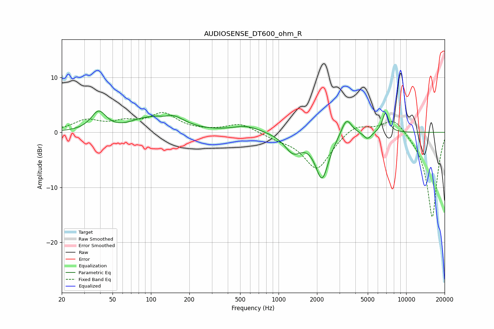

# AUDIOSENSE_DT600_ohm_R
See [usage instructions](https://github.com/jaakkopasanen/AutoEq#usage) for more options and info.

### Parametric EQs
Apply preamp of -4.0 dB when using parametric equalizer.

|   # | Type    |   Fc (Hz) |    Q |   Gain (dB) |
|-----|---------|-----------|------|-------------|
|   1 | Peaking |        39 | 2.45 |         3.5 |
|   2 | Peaking |        83 | 1.43 |         1.2 |
|   3 | Peaking |       129 | 3.05 |        -0.9 |
|   4 | Peaking |       136 | 1.28 |         3.3 |
|   5 | Peaking |       560 | 1.3  |         1.2 |
|   6 | Peaking |      1300 | 2.14 |        -3.2 |
|   7 | Peaking |      2191 | 2.69 |        -8.1 |
|   8 | Peaking |      3406 | 3.4  |         3.3 |
|   9 | Peaking |      4977 | 4.68 |        -1.3 |
|  10 | Peaking |      6887 | 5.37 |         3.6 |

### Fixed Band EQs
When using fixed band (also called graphic) equalizer, apply preamp of **-3.7 dB** (if available) and set gains manually with these parameters.

|   # | Type    |   Fc (Hz) |    Q |   Gain (dB) |
|-----|---------|-----------|------|-------------|
|   1 | Peaking |        31 | 1.41 |         2   |
|   2 | Peaking |        62 | 1.41 |         1.5 |
|   3 | Peaking |       125 | 1.41 |         3.2 |
|   4 | Peaking |       250 | 1.41 |         0.1 |
|   5 | Peaking |       500 | 1.41 |         1.6 |
|   6 | Peaking |      1000 | 1.41 |        -0.8 |
|   7 | Peaking |      2000 | 1.41 |        -6.7 |
|   8 | Peaking |      4000 | 1.41 |         1.8 |
|   9 | Peaking |      8000 | 1.41 |         3   |
|  10 | Peaking |     16000 | 1.41 |       -15.6 |

### Graphs

